<div class="MCWHeader1">
Implementing Windows Virtual Desktop in the enterprise
</div>

<div class="MCWHeader2">
Hands-on lab step-by-step guide
</div>

<div class="MCWHeader3">
September 2020
</div>

Information in this document, including URL and other Internet Web site references, is subject to change without notice. Unless otherwise noted, the example companies, organizations, products, domain names, e-mail addresses, logos, people, places, and events depicted herein are fictitious, and no association with any real company, organization, product, domain name, e-mail address, logo, person, place or event is intended or should be inferred. Complying with all applicable copyright laws is the responsibility of the user. Without limiting the rights under copyright, no part of this document may be reproduced, stored in or introduced into a retrieval system, or transmitted in any form or by any means (electronic, mechanical, photocopying, recording, or otherwise), or for any purpose, without the express written permission of Microsoft Corporation.

Microsoft may have patents, patent applications, trademarks, copyrights, or other intellectual property rights covering subject matter in this document. Except as expressly provided in any written license agreement from Microsoft, the furnishing of this document does not give you any license to these patents, trademarks, copyrights, or other intellectual property.

The names of manufacturers, products, or URLs are provided for informational purposes only and Microsoft makes no representations and warranties, either expressed, implied, or statutory, regarding these manufacturers or the use of the products with any Microsoft technologies. The inclusion of a manufacturer or product does not imply endorsement of Microsoft of the manufacturer or product. Links may be provided to third party sites. Such sites are not under the control of Microsoft and Microsoft is not responsible for the contents of any linked site or any link contained in a linked site, or any changes or updates to such sites. Microsoft is not responsible for webcasting or any other form of transmission received from any linked site. Microsoft is providing these links to you only as a convenience, and the inclusion of any link does not imply endorsement of Microsoft of the site or the products contained therein.

© 2020 Microsoft Corporation. All rights reserved.

Microsoft and the trademarks listed at <https://www.microsoft.com/en-us/legal/intellectualproperty/Trademarks/Usage/General.aspx> are trademarks of the Microsoft group of companies. All other trademarks are property of their respective owners.


**Contents**

<!-- TOC -->

- [Implementing Windows Virtual Desktop for the enterprise hands-on lab step-by-step](#implementing-windows-virtual-desktop-for-the-enterprise-hands-on-lab-step-by-step)
  - [Abstract and learning objectives](#abstract-and-learning-objectives)
  - [Overview](#overview)
  - [Solution architecture](#solution-architecture)
  - [Requirements](#requirements)
  - [Before the hands-on lab](#before-the-hands-on-lab)
  - [Exercise 1: Configuring Azure AD Connect with AD DS](#exercise-1-configuring-azure-ad-connect-with-ad-ds)
    - [Task 1: Connecting to the domain controller](#task-1-connecting-to-the-domain-controller)
    - [Task 2: Disabling IE Enhanced Security](#task-2-disabling-ie-enhanced-security)
    - [Task 3: Creating a domain admin account](#task-3-creating-a-domain-admin-account)
    - [Task 4: Configuring Azure AD Connect](#task-4-configuring-azure-ad-connect)
  - [Exercise 2: Create Azure AD groups for WVD](#exercise-2-create-azure-ad-groups-for-wvd)
    - [Task 1: Creating Azure AD groups](#task-1-creating-azure-ad-groups)
    - [Task 2: Assign users to groups](#task-2-assign-users-to-groups)
  - [Exercise 3: Create an Azure Files Share for FSLogix](#exercise-3-create-an-azure-files-share-for-fslogix)
    - [Task 1: Create a storage account](#task-1-create-a-storage-account)
    - [Task 2: Create an Azure file share](#task-2-create-an-azure-file-share)
    - [Task 3: Enable AD authentication for your storage account](#task-3-enable-ad-authentication-for-your-storage-account)
    - [Task 4: Configure share permissions](#task-4-configure-share-permissions)
    - [Task 5: Configure NTFS permissions for the file share](#task-5-configure-ntfs-permissions-for-the-file-share)
    - [Task 6: Configure NTFS permissions for the containers](#task-6-configure-ntfs-permissions-for-the-containers)
  - [Exercise 4: Create a master image for WVD](#exercise-4-create-a-master-image-for-wvd)
    - [Task 1: Create a new Virtual Machine (VM) in Azure](#task-1-create-a-new-virtual-machine-vm-in-azure)
    - [Task 2: Run Windows Update](#task-2-run-windows-update)
    - [Task 3: Prepare WVD image](#task-3-prepare-wvd-image)
    - [Task 4: Run Sysprep](#task-4-run-sysprep)
    - [Task 5: Create a managed image from the Master Image VM](#task-5-create-a-managed-image-from-the-master-image-vm)
    - [Task 6: Provision a Host Pool with a custom image](#task-6-provision-a-host-pool-with-a-custom-image)
  - [Exercise 5: Create a host pool for pooled desktops](#exercise-5-create-a-host-pool-for-pooled-desktops)
    - [Task 1: Create a new Host Pool and Workspace](#task-1-create-a-new-host-pool-and-workspace)
    - [Task 2: Create a friendly name for the workspace](#task-2-create-a-friendly-name-for-the-workspace)
    - [Task 3: Assign an Azure AD group to an application group](#task-3-assign-an-azure-ad-group-to-an-application-group)
  - [Exercise 6: Create a host pool for pooled remote apps](#exercise-6-create-a-host-pool-for-pooled-remote-apps)
    - [Task 1: Create a new host pool and workspace](#task-1-create-a-new-host-pool-and-workspace-1)
    - [Task 2: Create a friendly name for the workspace](#task-2-create-a-friendly-name-for-the-workspace-1)
    - [Task 3: Add Remote Apps to your Host Pool](#task-3-add-remote-apps-to-your-host-pool)
  - [Exercise 7: Create a host pool for personal desktops](#exercise-7-create-a-host-pool-for-personal-desktops)
    - [Task 1: Create a new host pool and workspace](#task-1-create-a-new-host-pool-and-workspace-2)
    - [Task 2: Create a friendly name for the workspace](#task-2-create-a-friendly-name-for-the-workspace-2)
    - [Task 3: Assign Azure AD group to application group](#task-3-assign-azure-ad-group-to-application-group)
  - [Exercise 8: Connect to WVD with the web client](#exercise-8-connect-to-wvd-with-the-web-client)
    - [Task 1: Connecting with the HTML5 web client](#task-1-connecting-with-the-html5-web-client)
  - [Exercise 9: Connect to WVD with the windows desktop client](#exercise-9-connect-to-wvd-with-the-windows-desktop-client)
    - [Task 1: Connecting with the windows desktop client](#task-1-connecting-with-the-windows-desktop-client)
  - [Exercise 10: Configure session hosts with Group Policy](#exercise-10-configure-session-hosts-with-group-policy)
    - [Task 1: Create a Group Policy backup](#task-1-create-a-group-policy-backup)
    - [Task 2: Configure the Group Policy settings](#task-2-configure-the-group-policy-settings)
  - [Exercise 11: Setup monitoring for WVD](#exercise-11-setup-monitoring-for-wvd)
    - [Task 1: Create a Log Analytics workspace](#task-1-create-a-log-analytics-workspace)
    - [Task 2: Enabling diagnostic logging for WVD](#task-2-enabling-diagnostic-logging-for-wvd)
    - [Task 3: Enable logging for host pools](#task-3-enable-logging-for-host-pools)
    - [Task 4: Enable logging for application groups](#task-4-enable-logging-for-application-groups)
    - [Task 5: Enable logging for workspaces](#task-5-enable-logging-for-workspaces)
    - [Task 6: Enabling Azure Monitor for the session hosts](#task-6-enabling-azure-monitor-for-the-session-hosts)
  - [After the hands-on lab](#after-the-hands-on-lab)
    - [Task 1: Delete Resource groups to remove lab environment](#task-1-delete-resource-groups-to-remove-lab-environment)

<!-- /TOC -->

# Implementing Windows Virtual Desktop for the enterprise hands-on lab step-by-step

## Abstract and learning objectives

In this hands-on lab, you will implement a Windows Virtual Desktop Infrastructure and learn how-to setup a working WVD environment end-to-end in a typical Enterprise model. At the end of the lab, attendees will have deployed an Azure Active Directory Tenant with Azure AD Connect to an Active Directory Domain Controller that is running in Azure. You will also deploy the Azure infrastructure for the Windows Virtual Desktop Tenant(s), Host Pool(s) and session host(s), and connect to a WVD session utilizing different supported devices and browsers. You will publish Windows Virtual Desktops and remote apps, and configure user profiles and file shares with FSLogix.  Finally, you will configure monitoring and security for the Windows Virtual Desktop infrastructure and understand the steps to manage the master images.

## Overview

In this lab, attendees will deploy the [Windows Virtual Desktop (WVD)](https://azure.microsoft.com/en-us/services/virtual-desktop/) solution. Exclusively available as an Azure cloud service, Windows Virtual Desktop allows you to choose a flexible end user virtualized application or desktop delivery model that best aligns with your enterprise Azure cloud strategy. WVD simplifies the IT model to virtualize and deploy modern and legacy desktop app experiences with unified management---without needing to host, install, configure and manage components such as diagnostics, networking, connection brokering, and gateway. WVD brings together Microsoft Office 365 and Azure to provide users with the only multi-session Windows 10 experience with exceptional scale and reduced IT costs while empowering today's modern digital workspace.

## Solution architecture

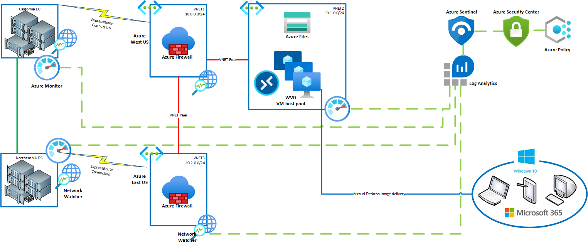 

This diagram shows a Windows Virtual Desktop architecture with on-premises servers for Active Directory.  In the diagram, the host pools are providing the WVD session to the different supported devices. Azure Monitor, Network Watcher, and Log Analytics are monitoring and logging activity and performance metrics.

## Requirements

Before you start setting up your Windows Virtual Desktop workspace, make sure you have the following items:

-   The Azure Active Directory tenant ID for Windows Virtual Desktop users.

-   A global administrator account within the Azure Active Directory tenant.

    -   This also applies to Cloud Solution Provider (CSP) organizations that are creating a Windows Virtual Desktop workspace for their customers. If you are in a CSP organization, you must be able to sign in as global administrator of the customer\'s Azure Active Directory tenant.

    -   The administrator account must be sourced from the Azure Active Directory tenant in which you are trying to create the Windows Virtual Desktop workspace. This process does not support Azure Active Directory B2B (guest) accounts.

    -   The administrator account must be a work or school account.

-   An Azure subscription.

    -   Enough Quota Cores to build four 4-core servers.

    -   Access to the Azure Active Directory Global Admin account for your new or existing Azure Active Directory Tenant.

    -   Owner rights on all Azure subscription(s).

## Before the hands-on lab

-   Refer to the Before the hands-on lab setup guide before continuing to the lab exercises.
  
-   Make sure to keep track of what user accounts you are using and where you are using them.

-   Regions and locations, make sure to stay consistent as much as possible.

## Exercise 1: Configuring Azure AD Connect with AD DS

Duration:  60 minutes

In this exercise you will be configuring [Azure AD Connect](https://docs.microsoft.com/en-us/azure/active-directory/hybrid/whatis-azure-ad-connect). With Windows Virtual Desktop, all session host VMs within the WVD tenant environment are required to be domain joined to AD DS, and the domain must be synchronized with Azure AD. To manage the synchronization of objects, you will configure Azure AD Connect on the domain controller deployed in Azure.

>**Note**: RDP access to a domain controller using a public IP address is not a best practice and is only done to simplify this lab. Better security practices such as removing the PIP, enabling just-in-time access and/or leveraging a bastion host should be applied enhance security.

**Additional Resources**

  |              |            |  
|----------|:-------------:|
| Description | Links |
| Windows Virtual Desktop Spring Update enters Public Preview |https://techcommunity.microsoft.com/t5/itops-talk-blog/windows-virtual-desktop-spring-update-enters-public-preview/ba-p/1340245|
|ARM-based model public preview) deployment walk through |https://www.christiaanbrinkhoff.com/2020/05/01/windows-virtual-desktop-technical-2020-spring-update-arm-based-model-deployment-walkthrough/#NewAzurePortal-Dashboard |
  |              |            | 

### Task 1: Connecting to the domain controller

1.  Sign in to the [Azure Portal](https://portal.azure.com/).

2.  Type **Resource groups** in the search field and select it from the list.

3.  On the Resource groups blade, Select on the resource group name that you created in the **Before the HOL** template deployment.

4.  On the Infra Resource group blade, review the list of available resources. Locate the resource named **AdPubIP1** and Select on it. Note that the resource type should be **Public IP address**.

    

5.  On the Overview page for AdPubIP1, locate the **IP address** field. Copy the IP address to a safe location.

6.  On your local machine, open the **RUN** dialog window, type **MSTSC** and hit enter.

    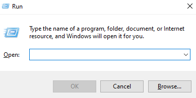 

7.  In the **Remote Desktop Connection** window, paste in the public IP address from the previous step. Select **Connect**.

     

8.  When prompted, sign in with the AD domain UPN credentials. For example, if you used the ARM template from [Before HOL setup guide](), the credentials will be something along the lines of: [adadmin\@MyADDomain.com](mailto:adadmin@MyADDomain.com) with the password: **WVD\@zureL\@b2019!**. If prompted, Select **Yes** to accept the RDP certification warning.

    >**Note**: This is the Active Directory account from the ARM template, not the Azure AD Global Admin account. If you have trouble signing in, try typing the credentials in manually, as copy and paste may include an unnecessary space, which will cause authentication to fail.

### Task 2: Disabling IE Enhanced Security

In an effort to simplify tasks in this lab, we will start by disabling [IE Enhanced Security](https://docs.microsoft.com/en-us/windows-hardware/customize/desktop/unattend/microsoft-windows-ie-esc).

1.  Once connected to the domain controller, open Server Manager if it does not start automatically.

2.  In Server Manager, select **Local Server** on the left.

3.  Locate the **IE Enhanced Security Configuration** option and Select **On**.

    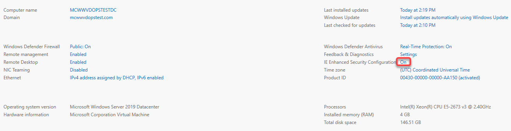 

4.  On the Internet Explorer Enhanced Security Configuration window, under **Administrators**, select the **Off** radio button and Select **OK**.

    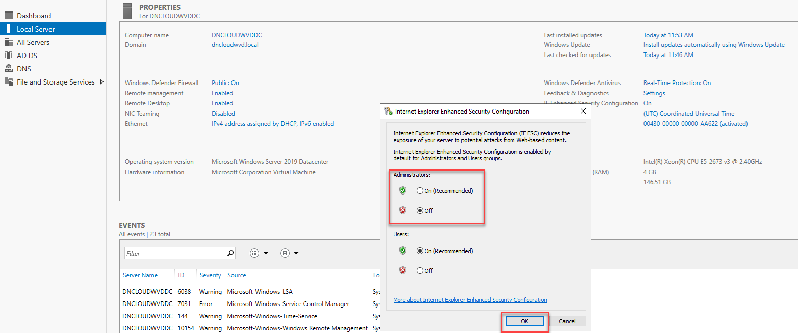

### Task 3: Creating a domain admin account

By default, Azure AD Connect does not synchronize the built-in domain administrator account [ADAdmin\@MyADDomain.com](mailto:ADAdmin@MyADDomain.com). This system account has the attribute isCriticalSystemObject set to *true*, preventing it from being synchronized. While it is possible to modify this, it is not a best practice to do so.

1.  In Server Manager, Select **Tools** in the upper right corner and select **Active Directory Users and Computers**.

     

2.  In Active Directory Users and Computers, right-click the **Users** organization unit and select **New \> User** from the menu.

    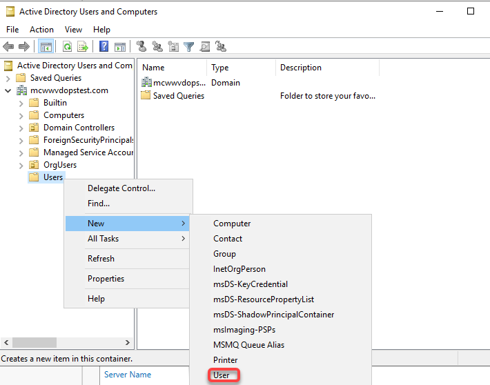 

3.  Complete the New User wizard.

    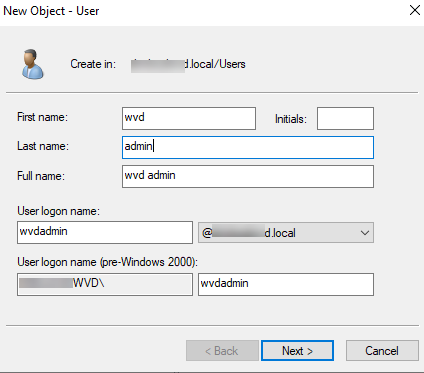


    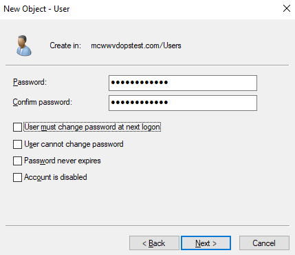 

    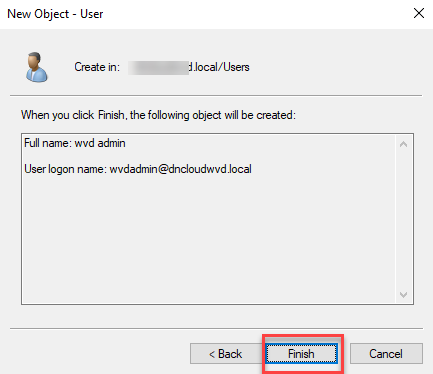

    >**Note**: This account will be important in future tasks. Make a note of the username and password you create. When setting the password, uncheck the box **User must change password at next logon**.

4.  In Active Directory Users and Computers, right-click on the new user account object and select **Add to a group**.

    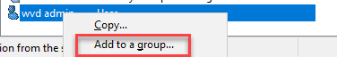

5.  On the Select Groups dialog window, type **Domain Admins** and Select **OK**.
   
    >**Note**: This account will be used during the host pool creation process for joining the hosts to the domain. Granting Domain Admin permissions will simplify the lab. However, any Active Directory account that has the following permissions will suffice. This can be done using [Active Directory Delegate Control](https://danielengberg.com/domain-join-permissions-delegate-active-directory/). 

    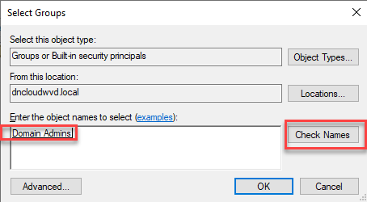

### Task 4: Configuring Azure AD Connect

1.  On the desktop of the domain controller, locate the icon for **Azure AD Connect** and open it.

    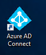

2.  Accept the license terms and privacy notice, then select continue. On the next screen select **Use express settings**. The required components will install.

     

3.  On the Connect to Azure AD page, enter in the Azure AD Global Admin credentials. For example: [azadmin\@MyAADdomain.onmicrosoft.com](mailto:azadmin@MyAADdomain.onmicrosoft.com) and the correct password. Select **Next**.

    
    >**Note**: This is the account associated with your Azure subscription.

4.  On the Connect to AD DS page, enter in the Active Directory credentials for a Domain Admin account. For example, if you used the ARM template deployment for the domain controller, the credentials will be something along the lines of: **[[MyADDomain.com]](http://myaddomain.com/) \\ADadmin** with the password: **WVD\@zureL\@b2019!**. Select **Next**.

    
    
    >**Note**: If you copy and paste the password, please ensure that there are no trailing spaces, as that will cause the verification to fail.

5.  Select **Install** to start the configuration and synchronization.

    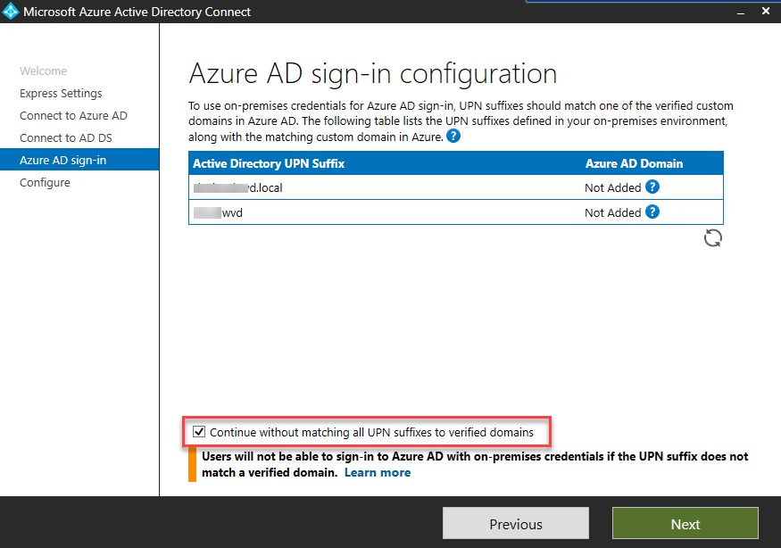

    

6.  After a few minutes the Azure AD Connect installation will complete.
    Select **Exit**.

    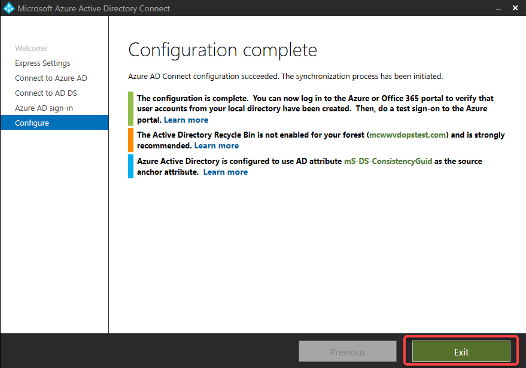
7.  Minimize the RDP session for the domain controller and wait a few minutes for the AD accounts to be synchronized to Azure AD.

8.  Sign in to the [Azure Portal](https://portal.azure.com/).

9.  Type **Azure Active Directory** in the search field and select it from the list.

10. On the Azure Active Directory blade, under **Manage**, select **Users**.

11. Review the list of user account objects and confirm the test accounts have synchronized.  

    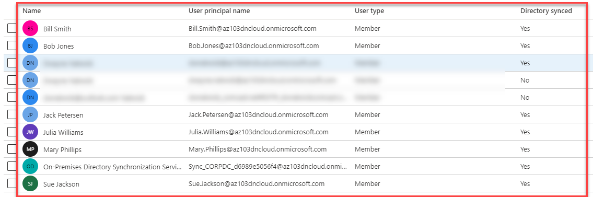

    >**Note**: It can take up to 15 minutes for the Active Directory objects to be synchronized to the Azure AD tenant.


## Exercise 2: Create Azure AD groups for WVD

Duration:  30 minutes

In this exercise you will be working with groups in Azure Active Directory (Azure AD) to assist in managing access assignment to your application groups in WVD. The new ARM portal for WVD supports access assignment using Azure AD groups. This capability greatly simplifies access management. Groups will also be leveraged in this guide to manage
share permissions in Azure Files for FSLogix.

You will be creating three Azure AD groups to manage access to the different application groups; Personal, Pooled, and RemoteApp. For this guide we will only create a single group for RemoteApps, but in a production scenario it is more common to use separate groups based on the app or persona defined by the customer. Be sure to make note of the groups you create, as they will be used in later exercises.

It is also important to keep in mind that these groups can also originate from the Windows Active Directory environment and synchronize via Azure AD Connect. This will be another common scenario for customers that already have processes defined on-premises for group management.

**Additional Resources**

  |              |            |  
|----------|:-------------:|
| Description | Links |
| Create a basic group and add members in Azure AD | https://docs.microsoft.com/en-us/azure/active-directory/fundamentals/active-directory-groups-create-azure-portal |
| Azure AD Connect sync |  https://docs.microsoft.com/en-us/azure/active-directory/hybrid/concept-azure-ad-connect-sync-user-and-contacts |
  |              |            | 

### Task 1: Creating Azure AD groups

1.  Sign in to the [Azure Portal](https://portal.azure.com/).

2.  At the top of the page, in the **Search resources** field, type **Azure Active Directory**. Select **Azure Active Directory** from the list.

3.  On the Azure Active Directory page, select **Groups** on the left and select **+ New group**.

4.  On the New Group page, fill in the following options and Select **Create**.

    -    **Group type:** Security

    -    **Group name:** WVD Pooled Desktop User

    -    **Membership type:** Assigned

    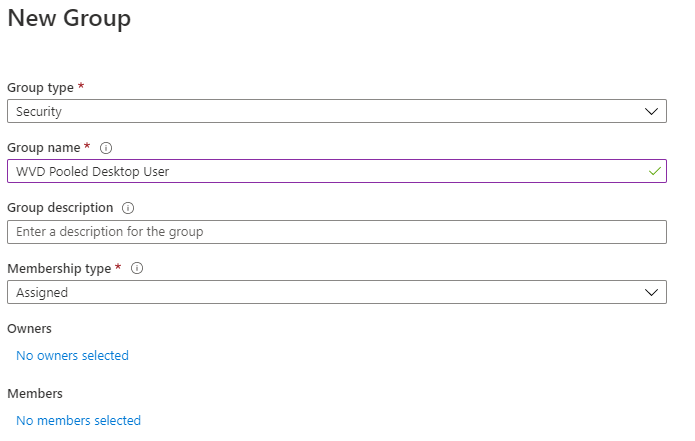

5.  Select **+ New group** again, fill in the following options and Select **Create**.

    -    **Group type:** Security

    -    **Group name:** WVD Remote App All Users

    -    **Membership type:** Assigned

    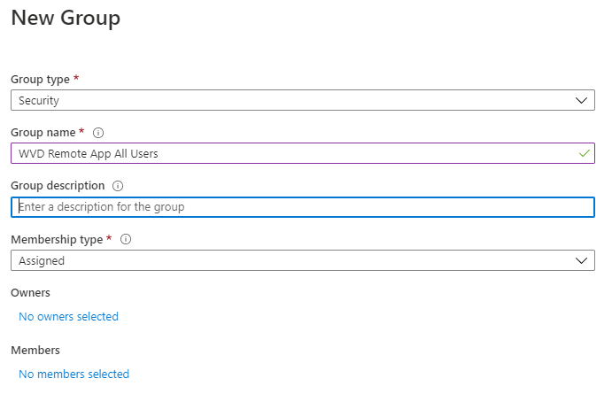

6.  Select **+ New group** again, fill in the following options and Select **Create**.

    -    **Group type:** Security

    -    **Group name:** WVD Persistent Desktop User

    -    **Membership type:** Assigned

    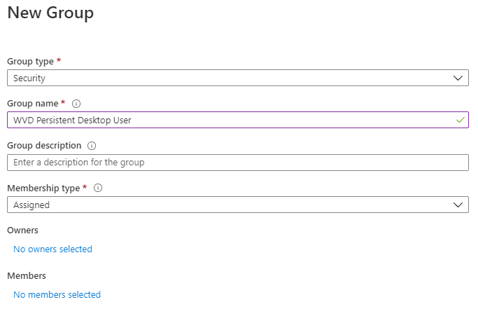

### Task 2: Assign users to groups

Now that the Azure AD groups are in place, we will assign users for testing. Once the groups are populated, we can leverage them for assigning access to WVD resources once they are created.

1.  Sign in to the [Azure Portal](https://portal.azure.com/).

2.  At the top of the page, in the **Search resources** field, type **Azure Active Directory**. Select **Azure Active Directory** from the list.

3.  On the Azure Active Directory page, select **Groups** on the left and select the desired group.

4.  Select **Members** and **+ Add Members**

    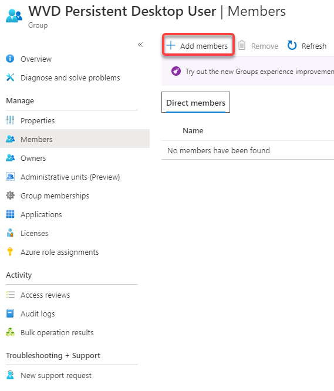

5.  In the search field, enter the name of a User to add **Select** to add them to the group.

6.  Repeat steps 4-6 for the other two groups.

At this point you have three new Azure AD groups with members assigned. Make a note of the group names and accounts you added for use later in this guide. These groups will be used to assign access to WVD application groups.

## Exercise 3: Create an Azure Files Share for FSLogix

Duration:  45 minutes

In this exercise you will be creating an Azure File share and enabling SMB access via Active Directory authentication. Azure Files is a platform service (PaaS) and is one of the recommended solutions for hosting FSLogix containers for WVD users. At the end of this exercise you will have the following components:

-   A new storage account in your Azure subscription.

-   A new Azure file share for your FSLogix profile containers.

-   AD authentication enabled for your Azure storage account.

-   Permissions applied for user access to the file share.

**Additional Resources**

  |              |            |  
|----------|:-------------:|
| Description | Links |
| Windows File Server |https://docs.microsoft.com/en-us/azure/virtual-desktop/create-host-pools-user-profile| 
|NetApp Files|https://docs.microsoft.com/en-us/azure/virtual-desktop/create-FSLogix-profile-container |
|Azure Files | https://docs.microsoft.com/en-us/azure/virtual-desktop/create-profile-container-adds |
|              |            |

### Task 1: Create a storage account

Before you can work with an Azure file share, you need to create an Azure storage account. To create a general-purpose v2 storage account in the Azure portal, follow these steps:

1.  Sign in to the [Azure Portal](https://portal.azure.com/).

2.  At the top of the page, in the **Search resources** field, type **storage accounts**. Select **Storage accounts** from the list.

    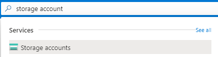

3.  On the Storage Accounts window that appears, Select **+ Add**.

4.  Fill in the required parameters for the storage account. Refer to the following example for more information on the available parameters. Make a note that contains the values you provide for **Resource group** and **Storage account name**. These will be needed later in the exercise.

    

    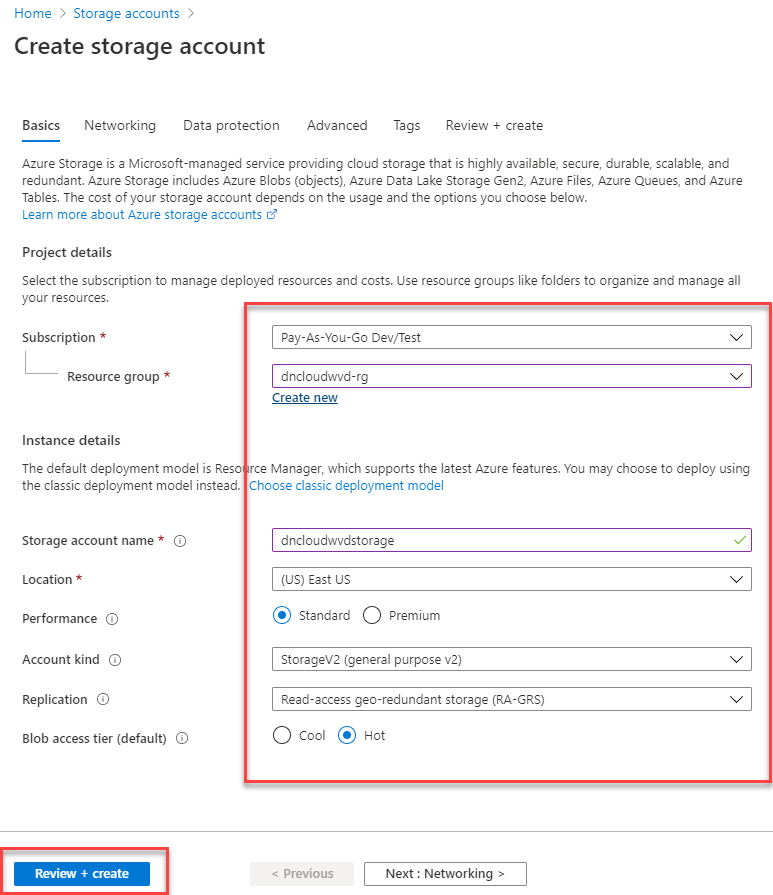

5.  Select **Review + Create** to review your storage account settings and create the account.

6.  Select **Create**.

### Task 2: Create an Azure file share

1.  At the top of the Azure Portal page, in the **Search resources** field, type **storage accounts**. Select **Storage accounts** from the list.

2.  On the Storage accounts blade, Select on the storage account you created in Task 1.

3.  On the Overview page for your Storage account, select **File shares**.

    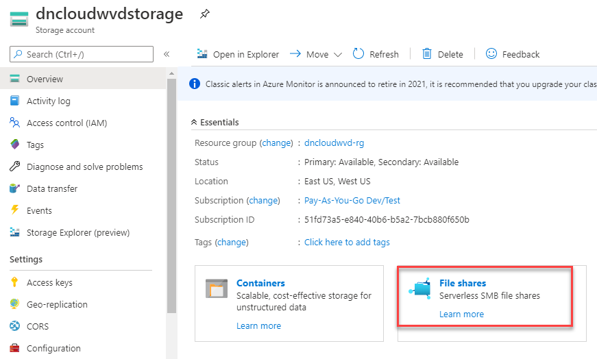

4.  On the File shares blade, Select **+ File Share**.

    

5.  Enter a Name the new file share, enter a quota in gigabits, and Select **Create**.

    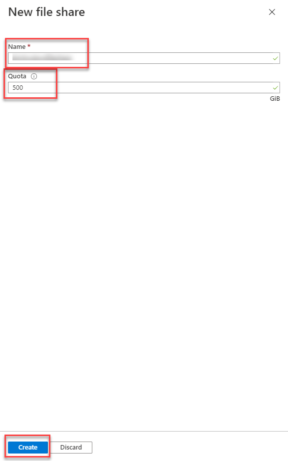
    
    >**Note**: The file share quota supports a maximum of 5,120 GiB and can be managed on the File shares blade.

### Task 3: Enable AD authentication for your storage account

**Prerequisites**

1.  The steps in this task need to be completed from a domain joined computer. The **AzFilesHybrid** module uses the AD PowerShell module, so running from a server is preferred.

    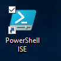

2.  The account used in this task needs to meet the following requirements:

    -    Synchronized with Azure AD.

    -    Permissions to create user or computer objects in Active Directory.

    -    Owner or Contributor rights on the Storage account.

In this task we will be completing the steps on the Domain Controller in Azure using an account that has been assigned Global Administrator and Domain Administrator. In a production environment, you can scale this back as long as you meet the minimum requirements above.

**Setup**

1.  From a domain joined computer, download and unzip the [AzFilesHybrid module](https://github.com/Azure-Samples/azure-files-samples/releases).

    

2. Extract this file to the **Documents** folder on the local Domain controller.

    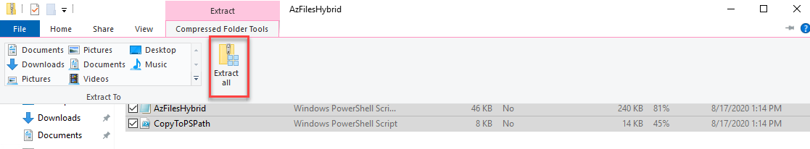

    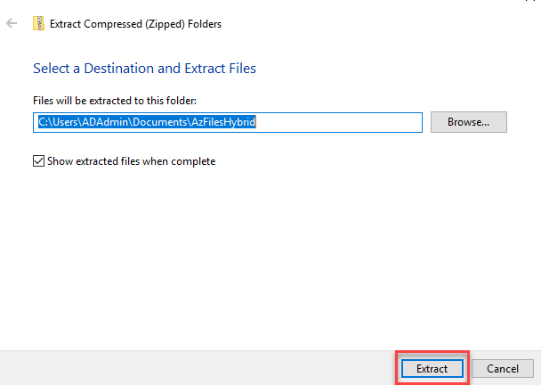

3.  Open an elevated PowerShell ISE window.

4.  Configure the PowerShell execution policy **Unrestricted** for the current user.

    ```
     Set-ExecutionPolicy -ExecutionPolicy Unrestricted -Scope CurrentUser
    ```

5.  Navigate to where you unzipped the AzFilesHybrid. For example:

    ```
    cd C:\\AzFilesHybrid
    ```

6.  Install the Az PowerShell module.

    ```  
    if ($PSVersionTable.PSEdition -eq 'Desktop' -and (Get-Module -Name AzureRM -ListAvailable)) {
    Write-Warning -Message ('Az module not installed. Having both the AzureRM and ' +
      'Az modules installed at the same time is not supported.')
    } else {
    Install-Module -Name Az -AllowClobber -Scope CurrentUser
    }
    ```

7.  Install the AzFilesHybrid module.

    ```
    .\\CopyToPSPath.ps1
    ```

8.  Import the AzFilesHybrid module.

    ```  
    Import-Module -Name AzFilesHybrid
    ```

9.  Sign in with an account that meets the prerequisites.

    ```
    Connect-AzAccount
    ```

10.  Create the following PowerShell variables:
    

    ```
    $SubscriptionId = "\<subscription-id\>\"
    $ResourceGroupName = "\<resource-group-name\>\"
    $StorageAccountName = "\<storage-account-name\>\"
    ```

    >**Note**: The Resource Group Name and Storage Account Name were assigned in Task 1.

    >**Note**: You can run **Get-AzSubscription** to lookup the available subscription names.


11.  Select the target subscription for the current session.
  

        ```
        Select-AzSubscription -SubscriptionId $SubscriptionId
        ```

12. Register the storage account with your Active Directory domain.

    ```
    Join-AzStorageAccountForAuth
    -ResourceGroupName $ResourceGroupName
    -Name $StorageAccountName
    -DomainAccountType "ServiceLogonAccount" 
    -OrganizationalUnitDistinguishedName "\<ou-name\>"
    ```

    >**Note**: You have the option to not provide an OU, in which case the object will be created in the root of the domain and can be moved manually. You also have the option to use **-OrganizationalUnitName** instead of the DN. If you choose to provide just the name, the object will be created in the first OU that matches that name.

    >**Note**: You have the option to set -DomainAccountType to **ComputerAccount** (computer object)
    or **ServiceLogonAccount** (user object). Both objects will work but watch for password change policies. In this example we are using ServiceLogonAccount because the user object is setup automatically with **Password never expires**.

13. Confirm the object was created successfully in **Active Directory Users and Computers**.

14. Confirm that the feature is enabled.

        ```
        $storageaccount = Get-AzStorageAccount -ResourceGroupName $ResourceGroupName -Name $StorageAccountName
        ```

15.  List the directory service of the selected service account.
 
        ```
        $storageAccount.AzureFilesIdentityBasedAuth.DirectoryServiceOptions
        ```

16. List the directory domain information if the storage account has enabled AD authentication for file shares.

    ```
    $storageAccount.AzureFilesIdentityBasedAuth.ActiveDirectoryProperties
    ```

17. You can also confirm activation with your domain by navigating to the Azure portal, going to the storage account and selecting **Configuration** under **Settings**. Refer to the group on Active Directory (AD), as shown in the example below.

You have now successfully enabled AD authentication over SMB and assigned a custom role that provides access to an Azure file share with an AD identity.

### Task 4: Configure share permissions

There are three Azure built-in roles for granting share-level permissions to users and/or groups:

-   **Storage File Data SMB Share Reader:** allows read access in Azure Storage file shares over SMB.

-   **Storage File Data SMB Share Contributor:** allows read, write, and delete access in Azure Storage file shares over SMB.

-   **Storage File Data SMB Share Elevated Contributor:** allows read, write, delete and modify NTFS permissions in Azure Storage file shares over SMB.

To access Azure Files resources with identity-based authentication, an identity (a user, group, or service principal) must have the necessary permissions at the share level. This process is similar to specifying Windows share permissions, where you specify the type of access that a particular user has to a file share. The guidance in this task demonstrates how to assign read, write, or delete permissions for a file share to an identity.

To simplify administration, create 4 new security groups in Active Directory to manage share permissions.

1.  From a domain joined computer, open **Active Directory Users and Computers**.

    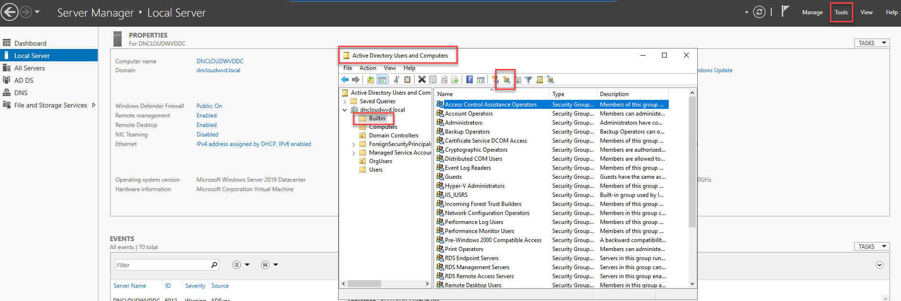

2.  Create the following Active Directory security groups in an OU that is synchronized with Azure AD:

    -   **AZF FSLogix Contributor**

        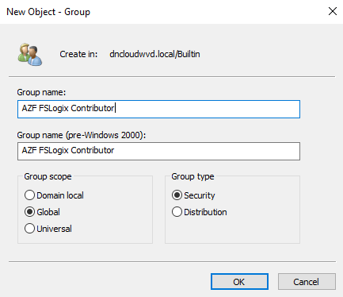

    -   **AZF FSLogix Elevated Contributor**

        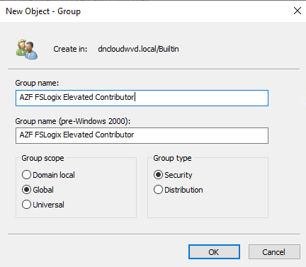

    -   **AZF FSLogix Reader**

        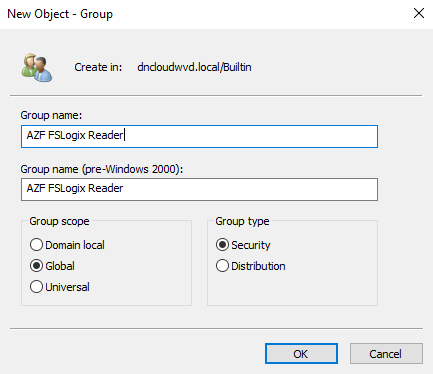

    -   **WVD Users**

        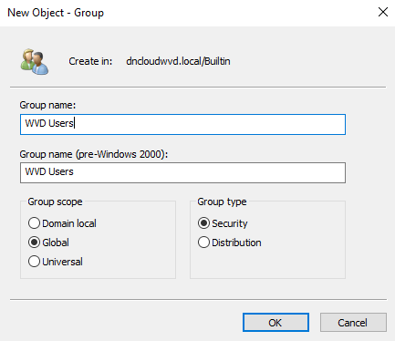

3.  Add an administrative account to the group **AZF FSLogix Elevated Contributor**. This account will have permissions to modify file share permissions.

4.  Add the group **WVD Users** to the group **AZF FSLogix Contributor**.

5.  Add user accounts to the group **WVD Users**. These users will have access to use FSLogix profiles.

    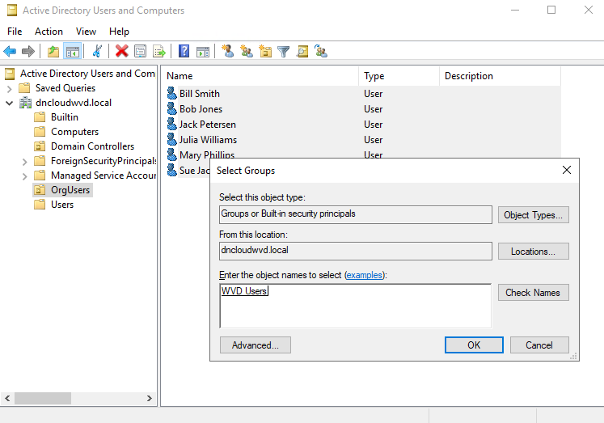

6.  Wait for the new groups to synchronize with Azure AD.

    With the new security groups available in Azure AD, use the following steps to assign them to your storage account in the Azure portal. This will enable to manage share permissions using AD security groups.

7.  In the Azure portal, in the **Search resources** field, type **storage accounts** and select **Storage accounts** from the list.

    

2.  On the Storage accounts blade, Select on the Storage account you created in Task 1.

3.  On the blade for your storage account, locate and Select on **File shares** .

4.  On the File shares blade, Select on your file share.

5.  Select **Access Control (IAM)**.

6.  Select **+ Add** and select **Add role assignment**.

    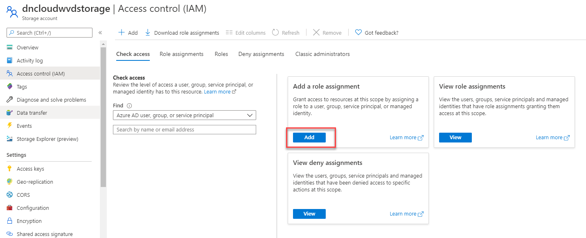

7.  On the Add role assignment fly out, fill in the following options and Select **Save**.

    -    **Role:** Storage File Data SMB Share Contributor

    -    **Assign access to:** Azure AD user, group, or service principal

    -    **Select:** AZF FSLogix Contributor

8.  Repeat steps 3-4 for the remaining two roles.

    -    Storage File Data SMB Share Elevated Contributor \> AZF FSLogix Elevated Contributor

    -    Storage File Data SMB Share Reader \> AZF FSLogix Reader

    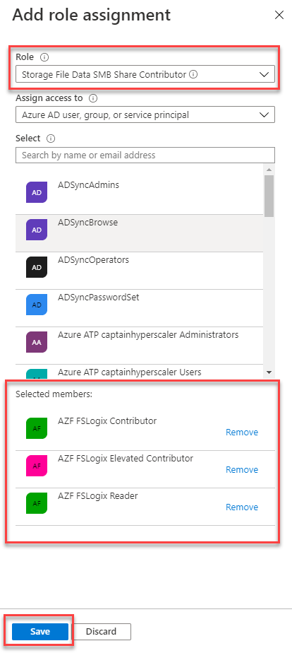

### Task 5: Configure NTFS permissions for the file share

After you assign share-level permissions with Azure RBAC, you must assign proper NTFS permissions at the root, directory, or file level. Think of share-level permissions as the high-level gatekeeper that
determines whether a user can access the share. Whereas NTFS permissions act at a more granular level to determine what operations the user can do at the directory or file level.

Azure Files supports the full set of NTFS basic and advanced permissions. You can view and configure NTFS permissions on directories and files in an Azure file share by mounting the share and then using Windows File Explorer or running the Windows icacls or Set-ACL command.

The first time you configure NTFS permission, do so using superuser permissions. This is accomplished by mounting the file share using your storage account key.

1.  In the Azure portal, in the **Search resources** field, type **storage accounts** and select **Storage accounts** from the list.

2.  On the Storage accounts blade, Select on the Storage account you created in Task 1.

3.  On the blade for your storage account, under **Settings**, select **Properties**. Locate the **Primary File Service Endpoint** address. This is the path you will use to access your file share. Reformat the path to UNC and copy it to a notepad file. For example:

    https://mydomainazfiles.file.core.windows.net/ ==
    \\\\mydomainazfiles.file.core.windows.net\\\<file-share-name\>

    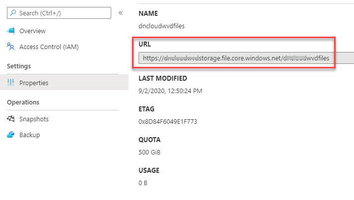

5.  On the blade for your storage account, under **Settings**, select **Access keys**. Copy the value for **key1** to the same notepad file.

6.  From a domain joined computer, open a standard command prompt and mount your file share using the storage account key. **Do not** use an elevated command prompt or the mount point will not be visible in File Explorer. 
     
    >**Note**: Refer to the following examples to prepare your command:
    net use z:\\\\\<storage-account-name\>.file.core.windows.net\\\<share-name\>/user:Azure\\\<storage-account-name\> \<storage-account-key\>

        Example with sample values:
                
        net use z: \\\\mydomainazfiles.file.core.windows.net\\FSLogix/user:Azure\\mydomainazfilesuPCvi+gP2qbCQcn3EATgbALE0H8nxhspyLRO2Nf9Hm2gMxfn/389/M33XHh7YEqNJ2GhbJXgStiifPwMBXk38Q==
        

    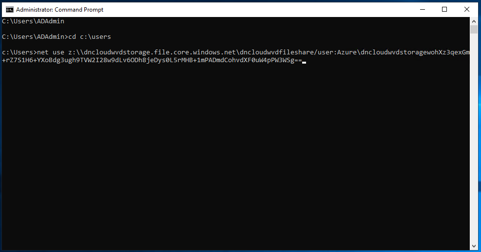

    >**Note**: This is an SMB connection on port 445. Most consumer ISPs block this port by default. If you are doing this in your lab and experience issues mounting the share from a local computer, try connecting from a domain joined VM in Azure.

7.  Open **File Explorer**, right-click on the **X:** drive and select **Properties**.

8.  On the properties window, select the **Security** tab and Select **Advanced**.

    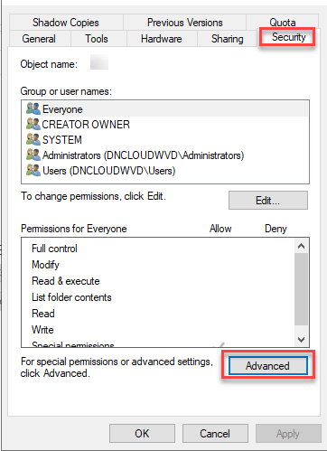

9.  Select **Add** and add each of the AD security groups you created in Task 4 with the appropriate permissions.  Select check names as each is entered to verify the connection.

    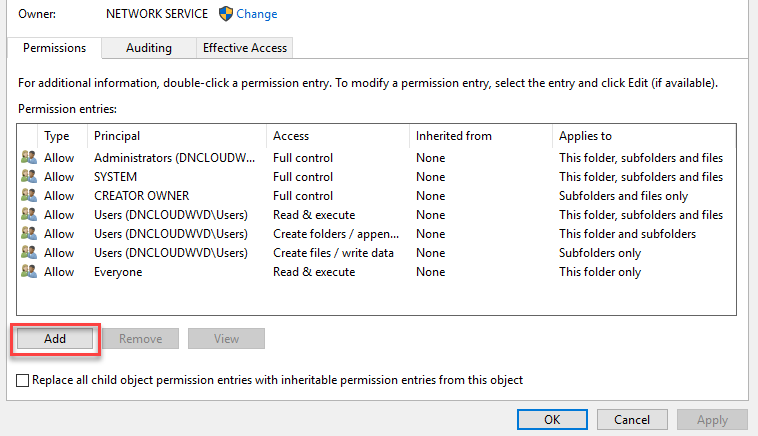

10. Select **OK** to save your changes.

    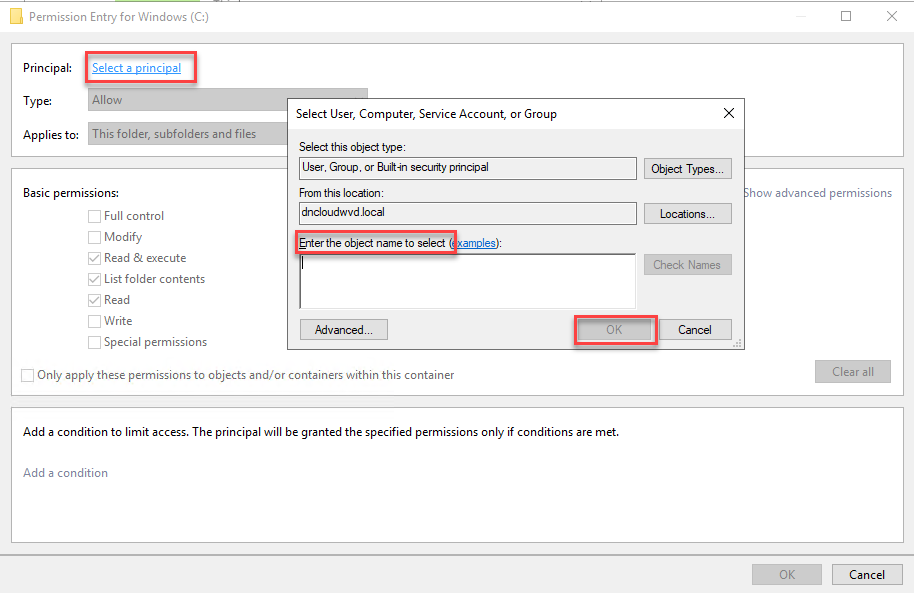

11. Disconnect the mount point by running the following in the command prompt.

    ```
    net use /delete z:
    ```

### Task 6: Configure NTFS permissions for the containers

With the NTFS permissions applied at the root file share, you can now create the FSLogix folder structure and recommended NTFS permissions. There are many ways to create secure and functional storage permissions for use with Profile Containers and Office Container. Below is one configuration option that provides new-user functionality and doesn't require users to have administrative permissions.

In this task we will create directories for each of the FSLogix profile types and assign the recommended permissions.

1.  From a domain joined computer, browse to your Azure file share using the account you added previously to the **AZF FSLogix Elevated Contributor** security group.

    ```
    \\\\mydomainazfiles.file.core.windows.net\\\<file-share-name\>
    ```

3.  Create three new directories in the root share.

    -    **Profiles**

    -    **ODFC**

    -    **MSIX**

4.  Right-click on the **Profiles** directory and select **Properties**.

5.  On the properties window, select the **Security** tab and Select **Advanced**.

6.  Select **Disable inheritance** and select **Remove all inherited permissions from this object**.

7.  Select **Add** and add **AZF FSLogix Elevated Contributor**. Grant **Full Control** to **This folder, subfolders and files**. Select **OK**.

8.  Select **Add** and add **Creator owner**. Grant **Full Control** to **Subfolders and files only**. Select **OK**.

9.  Select **Add** and add **WVD Users**. Grant the following special permissions to **This folder only**. Select **OK**.

    -   Traverse folder / execute file

    -   List folder / read data

    -   Read attributes

    -   Create folders / append data

10. Select **OK** on both property windows to apply your changes.

11. Repeat steps 3-9 for the **ODFC** directory.

12. Right-click on the **MSIX** directory and select **Properties**.

13. On the properties window, select the **Security** tab and Select **Advanced**.

14. Select **Disable inheritance** and select **Remove all inherited permissions from this object**.

15. Select **Add** and add **AZF FSLogix Elevated Contributor**. Grant **Full Control** to **This folder, subfolders and files**. Select **OK**.

16. Select **Add** and add **WVD Users**. Grant **Read & execute** to **This folder, subfolders and files**. Select **OK**.

17. Confirm your permissions match the screenshots below.

18. Select **OK** on both property windows to apply your changes.

Your Azure Files Share is now ready for FSLogix profile containers. Copy the UNC path and add it to your FSLogix deployment (image, GPO, etc..).

## Exercise 4: Create a master image for WVD

Duration:  90 minutes

In this exercise we are going to walk through the process of creating a master image for your WVD host pools. The basic concept for a master image is to start with a clean base install of Windows and layer on mandatory updates, applications and configurations. There are many ways to create and manage images for WVD. The steps covered in this exercise are going to walk you through a basic build and capture process that includes core applications and recommended configuration options for WVD.

**Additional Resources**

  |              |            |  
|----------|:-------------:|
| Description | Links |
| Create a managed image of a generalized VM in Azure | https://docs.microsoft.com/en-us/azure/virtual-machines/windows/capture-image-resource |
  |   For more information on how to deploy a virtual machine in Azure |https://docs.microsoft.com/en-us/azure/virtual-machines/windows/quick-create-portal |
For more information on how to setup a Bastion host in Azure|https://docs.microsoft.com/en-us/azure/bastion/bastion-create-host-portal|
  |              |            | 


### Task 1: Create a new Virtual Machine (VM) in Azure

1.  Sign in to the [Azure Portal](https://portal.azure.com/).

2.  On the Azure portal home page, Select **Create a resource**.

3.  On the New page, search for **Microsoft Windows 10**. Select **Windows 10 Enterprise multi-session, Version 1909** and Select **Create**.

    

    >**Note**: In this exercise we are selecting a base Windows 10 image to start with, and installing Office 365 ProPlus using a custom deployment script. We are also using the latest available release of Windows 10 Enterprise multi-session, but you can choose the version based on your requirements.

1.  On the Create a virtual machine page, fill in the required fields and create the VM.

    >**Note**: Make a note of the **Username** and **Password** used to create the VM. This information will be required to access the VM after creation.

    >**Note**: This guide does not walk through the process of creating a VM in Azure. However, for **Inbound port rules**, be sure to allow **RDP (3389)** , or have a bastion host deployed for remote access.

    

5.  Once the VM is successfully deployed, connect using RDP. Sign in using the credentials you supplied when creating the VM.

### Task 2: Run Windows Update

Despite the Azure support teams best efforts, the Marketplace images are not always up to date. The best and most secure practice is to keep your master image up to date.

1.  From your master image VM, open the **Settings** app and select **Updates & Security**.

    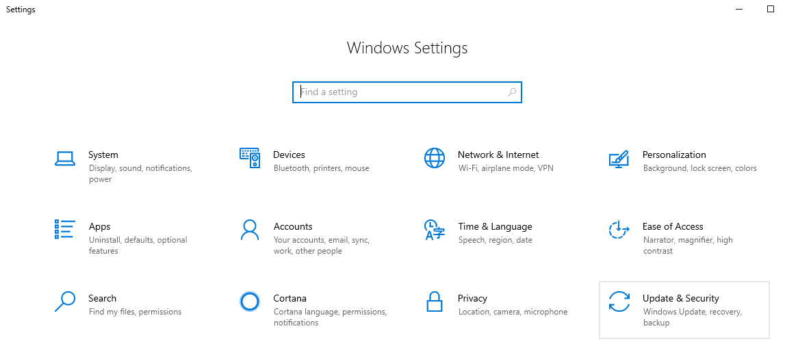

2.  Install all missing updates, rebooting as necessary.

3.  Once the VM is fully patched, the Windows Update Settings page should resemble the following screenshot.

    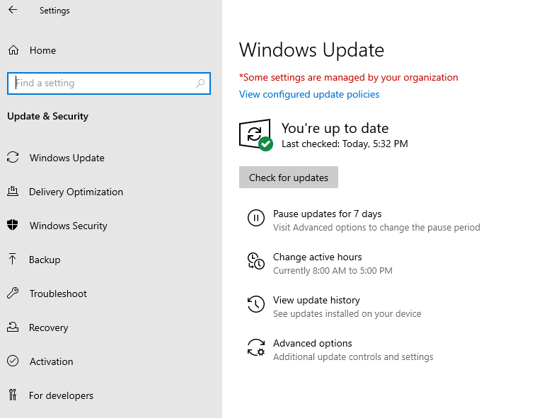

### Task 3: Prepare WVD image

**Introduction to the script**

The authors for this content have developed a scripted solution to assist in automating some common baseline image build tasks. The script includes a UI form, enabling you to quickly select which actions to perform. The end result will be a custom master image that incorporates Microsoft's main business applications, along with the necessary
policies and settings for an optimized user experience.

The script and related tools are maintained in GitHub - [Download Link](https://minhaskamal.github.io/DownGit/#/home?url=https://github.com/shawntmeyer/WVD/tree/master/Image-Build/Customizations) 

For additional documentation about the script (e.g. parameters, functions, etc.), refer to the comments in **Prepare-WVDImage.ps1**.

For troubleshooting script execution, refer to the following log directory on the target machine: **C:\\Windows\\Logs\\ImagePrep**.

This script leverages the [Local Group Policy Object (LGPO)](https://docs.microsoft.com/en-us/windows/security/threat-protection/security-compliance-toolkit-10#what-is-the-local-group-policy-object-lgpo-tool) tool in the [Microsoft Security Compliance Toolkit (SCT)](https://docs.microsoft.com/en-us/windows/security/threat-protection/security-compliance-toolkit-10) to apply settings in the image. The settings are documented and exported on the target machine under **C:\\Windows\\Logs\\ImagePrep\\LGPO**. This approach was taken to simplify troubleshooting, enabling you to leverage Group Policy Results.

The UI form offers the following actions:

**Office 365 ProPlus**

-   Install the **latest** version of Office 365 ProPlus monthly channel.

-   Apply recommended settings.

-   Source documentation: [Install Office on a master VHD image](https://docs.microsoft.com/en-us/azure/virtual-desktop/install-office-on-wvd-master-image).

**OneDrive for Business**

-   Install the **latest** version of OneDrive for Business *per-machine*.

-   Source documentation: [Install Office on a master VHD image](https://docs.microsoft.com/en-us/azure/virtual-desktop/install-office-on-wvd-master-image).

**Microsoft Teams**

-   Install the **latest** version of Microsoft Teams *per-machine*.

-   Source documentation: [Use Microsoft Teams on Windows Virtual desktop](https://docs.microsoft.com/en-us/azure/virtual-desktop/teams-on-wvd).

**Microsoft Edge Chromium**

-   Install the **latest** version of Microsoft Edge Enterprise.

-   Apply recommended settings.

-   Source documentation: [Deploy Microsoft Edge using System Center Configuration Manager](https://docs.microsoft.com/en-us/deployedge/deploy-edge-with-configuration-manager).

**FSLogix Profile Containers**

-   Install the **latest** version of the FSLogix Agent.

-   Apply recommended settings.

-   Source documentation: [Download and Install FSLogix](https://docs.microsoft.com/en-us/FSLogix/install-ht).

**OS Settings**

-   Apply the recommended WVD settings for image capture.

-   Source documentation: [Prepare and customize a master VHD image](https://docs.microsoft.com/en-us/azure/virtual-desktop/set-up-customize-master-image).

-   Apply the recommended settings for capturing an Azure VM.

-   Source documentation: [Prepare a Windows VHD or VHDX to upload to Azure](https://docs.microsoft.com/en-us/azure/virtual-machines/windows/prepare-for-upload-vhd-image). 

-   Run Disk Cleanup.

-   Source documentation: [cleanmgr](https://docs.microsoft.com/en-us/windows-server/administration/windows-commands/cleanmgr). 

**Running the script**

1.  [**Download**](https://minhaskamal.github.io/DownGit/#/home?url=https://github.com/shawntmeyer/WVD/tree/master/Image-Build/Customizations) the .zip file to your local workstation.

2.  **Copy** the .zip file on your local workstation. Open the RDP window to your master image VM. **Paste** the .zip file to the desktop.

3.  On the master image VM, right-click on the .zip file on your desktop and select **Extract All\...**.

4.  Extract the files to **C:\\BuildArtifacts**.

5.  Open an elevated PowerShell window.

6.  Navigate to \"C:\\BuildArtifacts\\Customizations\".

    ```
    cd C:\\BuildArtifacts\\Customizations
    ```

7.  Run the following command to allow for script execution:

    ```
    Set-ExecutionPolicy -ExecutionPolicy Bypass -Scope Process -Force
    ```

8.  Execute the script by running the following command:

    ```
    .\\Prepare-WVDImage.ps1 -DisplayForm
    ```

This will trigger the PowerShell form to launch. Select the appropriate options based on the following input information.

-   Select **Install Office 365** to Install Office 365 ProPlus while excluding Teams, Groove and Skype. This will enable the Email and Calendar Caching settings below.

    >**Note**: Update these settings as necessary. The Microsoft recommended settings are pre-selected. If you do not wish to apply these settings to the image, then set each to \'Not Configured\'.

-   Select **Install FSLogix Agent** to install the FSLogix Agent. If you select this option, the option to specify the FSLogix User Profile Container VHD Path is enabled. If you do not want to specify this option in the image, blank out this setting.

-   Select **Install OneDrive per Machine** to install the OneDrive sync client per machine. If you select this option, it will enable the AAD Tenant ID field. Enter your tenant id here to enable silent Known Folder Move functionality in your image. If you do not want this in your image, blank out the value.

-   Select **Install Microsoft Teams per Machine** to install the per machine Teams install.

-   Select **Install Microsoft Edge Chromium v80+** to install the Edge Enterprise browser based on Chromium.

-   Select **Disable Windows Update** to disable Windows Update in the image.

-   Select **Run System Clean Up (CleanMgr.exe)** to execute Disk Cleanup.

9.  With the desired options selected, Select **Execute**.

    The form will close at this point and the script will begin configuring the image. **DO NOT close any of the remaining windows that appear until the script has finished execution**. Doing so will interrupt the process and will require you to start over.

    The script will take several minutes to complete depending on the options you selected. Additional input from you is not required during this stage, so feel free to minimize the RDP session and work on other tasks.

-   If you selected to install Office 365, you will see a setup.exe window during execution.

-   If you selected to install OneDrive, you will see a OneDrive window during execution.

-   If you selected to run System Clean Up, you will see the Disk Cleanup wizard during execution. This window may stay on the \"Windows Update Cleanup\" task for a few minutes while it cleans out older files in the Windows Side by Side.

    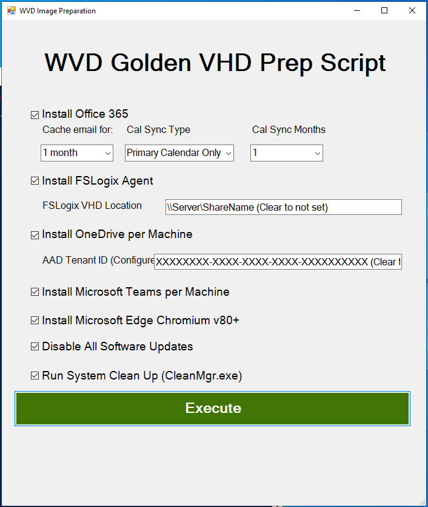

    >**Note**: After the Disk Cleanup Wizard closes, you may notice the PowerShell window does not update. It is waiting for the cleanmgr.exe process to close, which can take some time. You can select the PowerShell window and continue to hit the up arrow on your keyboard until you are presented with an active prompt.

10.  Once the script has completed execution, complete these final tasks:

-    Delete the C:\\BuildArtifacts directory.

-    Delete the .zip file on your desktop.

-    Empty the Recycle Bin.

-    Copy the C:\\Windows\\Logs\\ImagePrep\\LGPO directory to your local workstation.

-    Reboot the VM.

### Task 4: Run Sysprep

1.  After the VM has rebooted, reconnect your RDP session and sign in.

2.  Open an administrative command prompt.

3.  Navigate to: **C:\\Windows\\System32\\Sysprep**.

    ```
    cd C:\\Windows\\System32\\Sysprep
    ```

4.  Run the following command to sysprep the VM and shutdown:

    ```
    sysprep.exe /oobe /generalize /shutdown
    ``` 

The system will automatically shut down and disconnect your RDP session.

### Task 5: Create a managed image from the Master Image VM

1.  Sign in to the [Azure Portal](https://portal.azure.com/).

2.  At the top of the page, in the **Search resources** field, type **virtual machines**. Select **Virtual machines** from the list.

    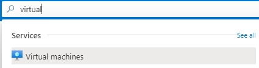

3.  On the Virtual machines blade, locate the VM you used for your master image and **Select** on the name.

4.  On the Overview blade for your VM, confirm the **Status** shows **Stopped**. Select **Stop** in the menu bar to move it to a deallocated state.

    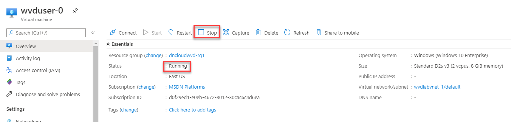

    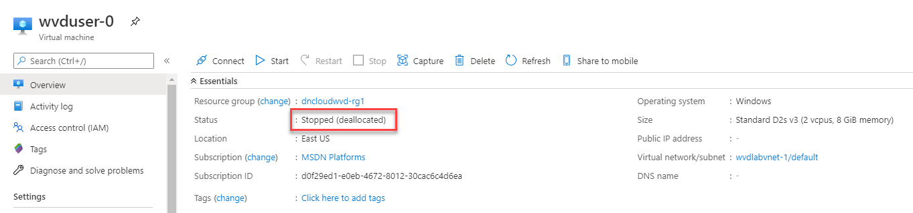

5.  Once complete, Select **Capture** in the menu bar.

    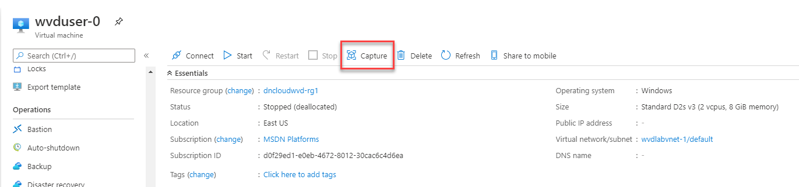

6.  On the Create image blade, fill in the required fields and Select **Create**.

    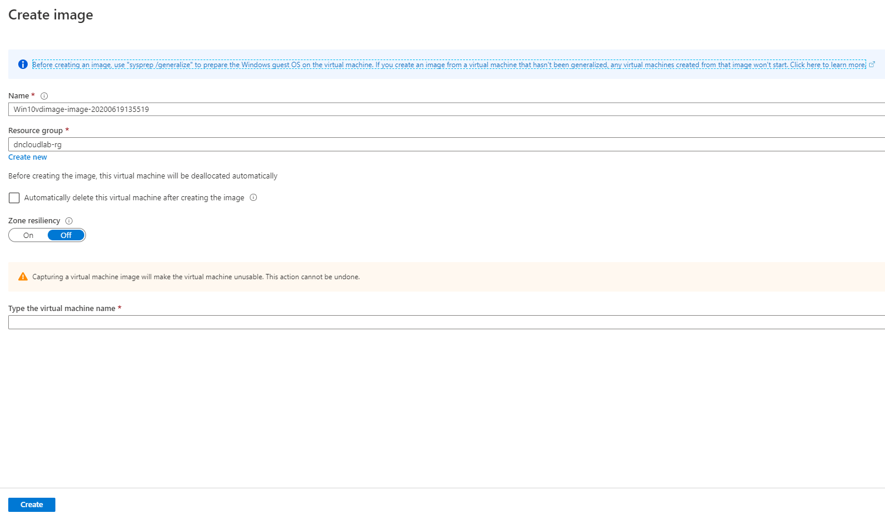

7.  Once complete, type **images** in the **Search resources field** at the top of the page. Select **Images** from the list.

8.  On the Images blade, locate your image and **Select** on the name.

9.  On the Overview blade for your image, make note of the **Name** field and **Resource group** field. These attributes are needed when you provision your host pools.

### Task 6: Provision a Host Pool with a custom image

1.  To start provisioning a host pool with your custom image, follow the instructions in [Exercise 5](#exercise-5-create-a-host-pool-for-pooled-desktops).

2.  When you get to the step to configure **Virtual machine settings**, select the option for **Managed Image** and fill in the required fields.


## Exercise 5: Create a host pool for pooled desktops

Duration:  20 minutes

In this exercise we will be creating a Windows Virtual Desktop host pool for pooled desktops. This is a set of computers or hosts which operate on an as-needed basis. In a pooled configuration we will be hosting multiple non-persistent sessions, with no user profile information stored locally. This is where FSLogix Profile Containers provide the users profile to the host dynamically. This provides the ability for an organization to fully utilize the compute resources on a single host and lower the total overhead, cost, and number of remote workstations.

**Additional Resources**

  |              |            |  
|----------|:-------------:|
| Description | Links |
| Create a host pool with the Azure portal | https://docs.microsoft.com/en-us/azure/virtual-desktop/create-host-pools-azure-marketplace |
  |              |            | 

### Task 1: Create a new Host Pool and Workspace

1.  Sign in to the [Azure Portal](https://portal.azure.com/).

2.  Search for **Windows Virtual Desktop** and select it from the list.

    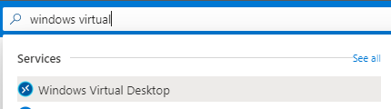    

3.  Under Manage, select **Host pools** and Select **+ Add**.
   
    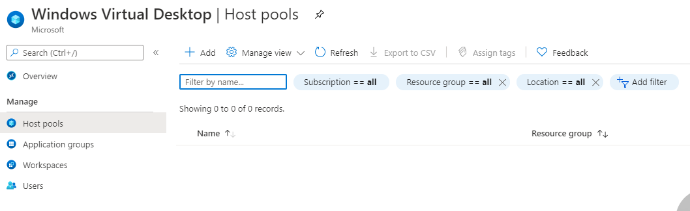

4.  On the Basics page, refer to the following screenshot to fill in the required fields. Once complete, Select **Next: Virtual Machines**.

    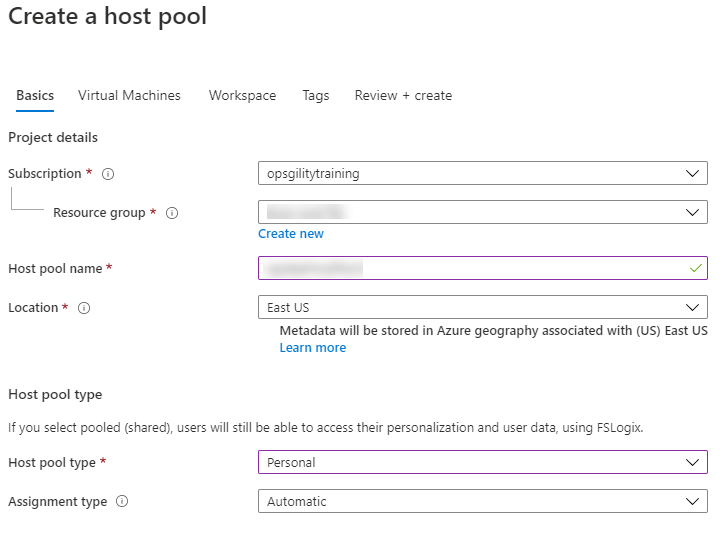

5.  On the Virtual Machines page, refer to the following screenshot to fill in the required fields. Once complete, Select **Next: Workspace**.

    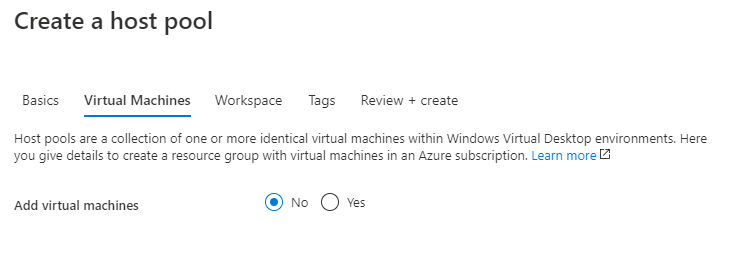

6.  On the Workspace page, select **Yes** to register a new desktop app group. Select **Create new** and provide a **Workspace name**. Select **OK** and **Review + create**.


    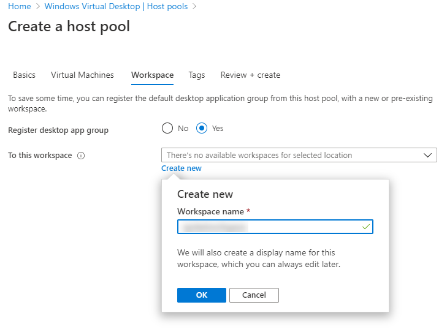

7.  On the Create a host pool page, Select **Create**.

### Task 2: Create a friendly name for the workspace

The name of the Workspace is displayed when the user signs in. Available resources are organized by Workspace. For a better user experience, we will provide a friendly name for our new Workspace.

1.  Sign in to the [Azure Portal](https://portal.azure.com/).

2.  Search for **Windows Virtual Desktop** and select it from the list.

    

3.  Under Manage, select **Workspaces**. Locate the Workspace you want to update and Select on the name.

4.  Under Settings, select **Properties**.

5.  Update the **Friendly name** field to your desired name.

6.  Select **Save**.

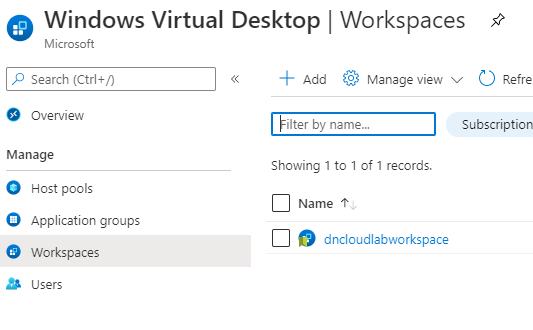

### Task 3: Assign an Azure AD group to an application group

In the new Windows Virtual Desktop ARM portal, we now have the ability to use Azure Active Directory groups to manage access to our host pools.

1.  Sign in to the [Azure Portal](https://portal.azure.com/).

2.  Search for **Windows Virtual Desktop** and select it from the list.

    

3.  Under Manage, select **Application groups**.
    
4.  Locate the Application group that was created as part of Task 1. In this exercise it is named "**WVD\_Pooled\_Desktop-DAG**". Select on the name.

5.  Under Manage, select **Assignments** and Select **+ Add**.

6.  In the fly out, enter the name of your Azure AD group. In this exercise we will select **WVD Pooled Desktop Users**.

7.  Choose **Select** to save your changes.

    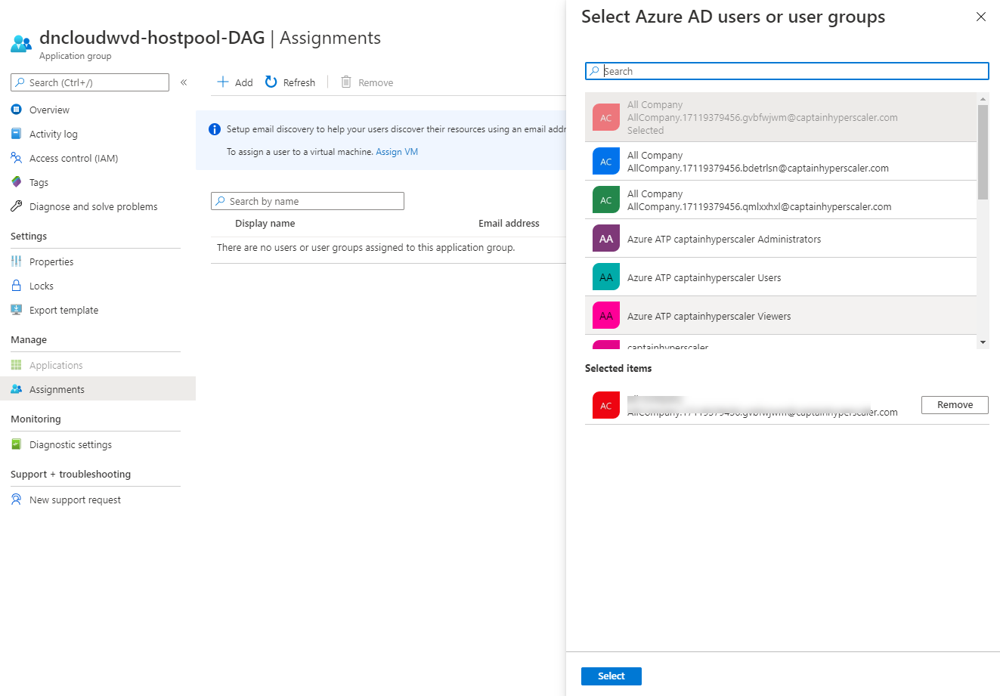

With the assignment added, you can move on to the next exercise. The users in the Azure AD group can be used to validate access to the new host pool in a later exercise.

## Exercise 6: Create a host pool for pooled remote apps

Duration:  30 minutes

In this exercise we will be creating a non-persistent host pool for publishing remote apps. This enables you to assign users access to specific applications rather than an entire desktop. This type of application deployment serves many purposes and is not new to WVD, but has existed in Windows Server Remote Desktop Services for many years.

**Additional Resources**

  |              |            |  
|----------|:-------------:|
| Description | Links |
| Publish built-in apps in Windows Virtual Desktop | https://docs.microsoft.com/en-us/azure/virtual-desktop/publish-apps |
| Manage app groups with the Azure portal | https://docs.microsoft.com/en-us/azure/virtual-desktop/manage-app-groups |
  |              |            | 

### Task 1: Create a new host pool and workspace

1.  Sign in to the [Azure Portal](https://portal.azure.com/).

2.  Search for **Windows Virtual Desktop** and select it from the list.

    

3.  Under Manage, select **Host pools** and Select **+ Add**.

    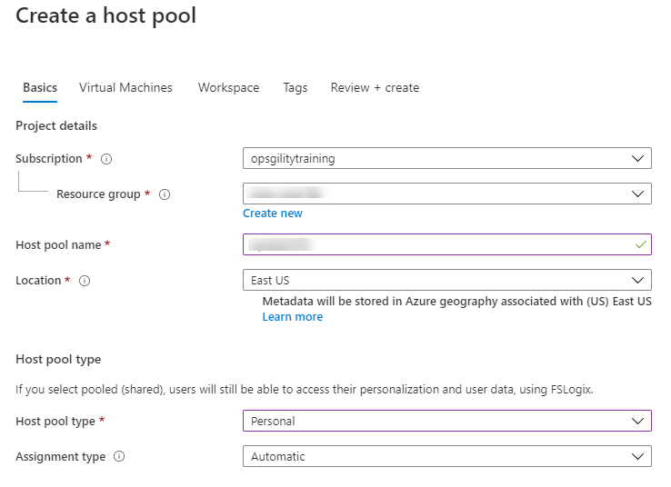

4.  On the Basics page, refer to the following screenshot to fill in the required fields. Once complete, Select **Next: Virtual Machine**.

    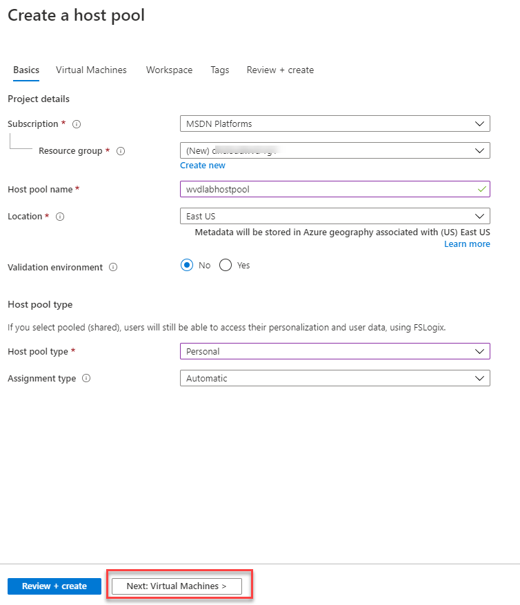

5.  On the Virtual Machines page, provision a Virtual machine with the Windows 10 multi-user + M365 apps. Once complete, Select **Next: Workspace**

    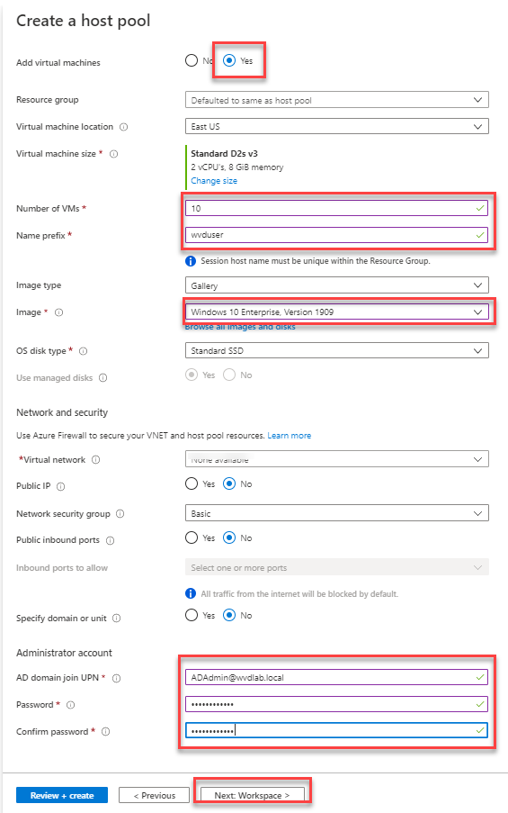

6.  On the Workspace page, select **Yes** to register a new desktop app group. Select **Create new** and provide a **Workspace name**. Select **OK** and **Review + create**.

    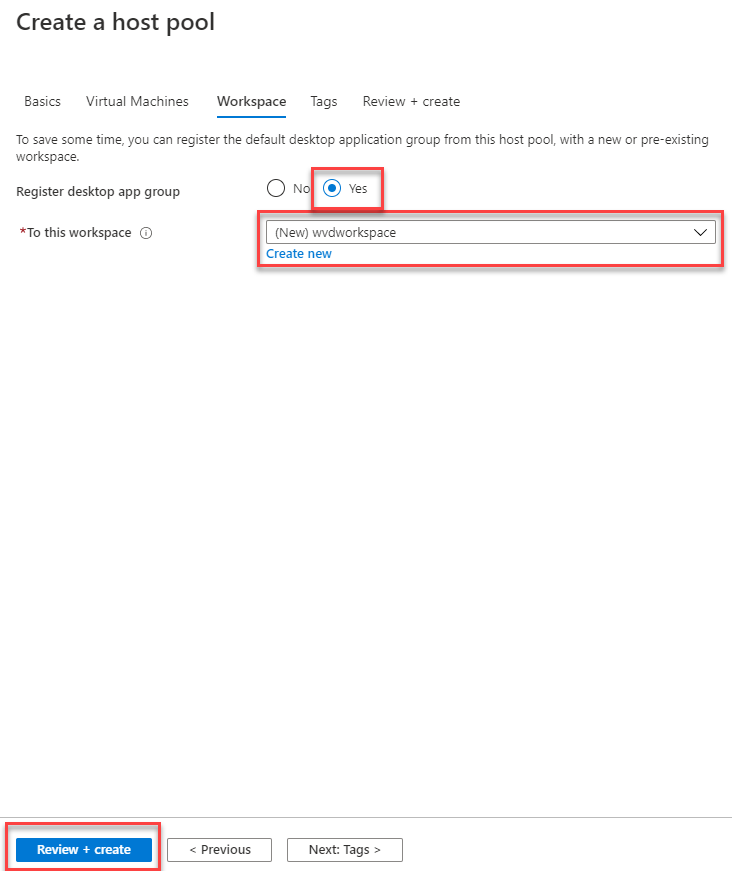

7.  On the Create a host pool page, Select **Create**.

### Task 2: Create a friendly name for the workspace

The name of the Workspace is displayed when the user signs in. Available resources are organized by Workspace. For a better user experience, we will provide a friendly name for our new Workspace.

1.  Sign in to the [Azure Portal](https://portal.azure.com/).

2.  Search for **Windows Virtual Desktop** and select it from the list.

    

3.  Under Manage, select **Workspaces**. Locate the Workspace you want to update and Select on the name.

4.  Under Settings, select **Properties**.

5.  Update the **Friendly name** field to your desired name.

6.  Select **Save**.

### Task 3: Add Remote Apps to your Host Pool

1.  Sign in to the [Azure Portal](https://portal.azure.com/).

2.  Search for **Windows Virtual Desktop** and select it from the list.

3.  Under Manage, select **Application groups** and Select **+ Add**.
   
    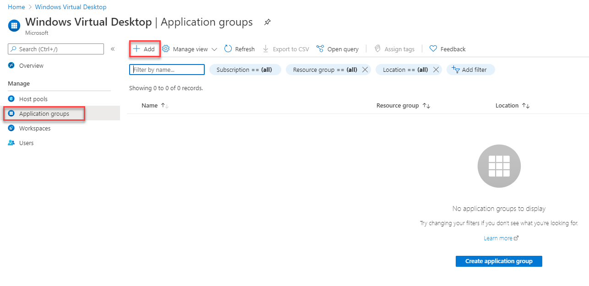

4.  On the Basics page, select your resource group and host pool. Once complete, Select **Next: Assignments**.

    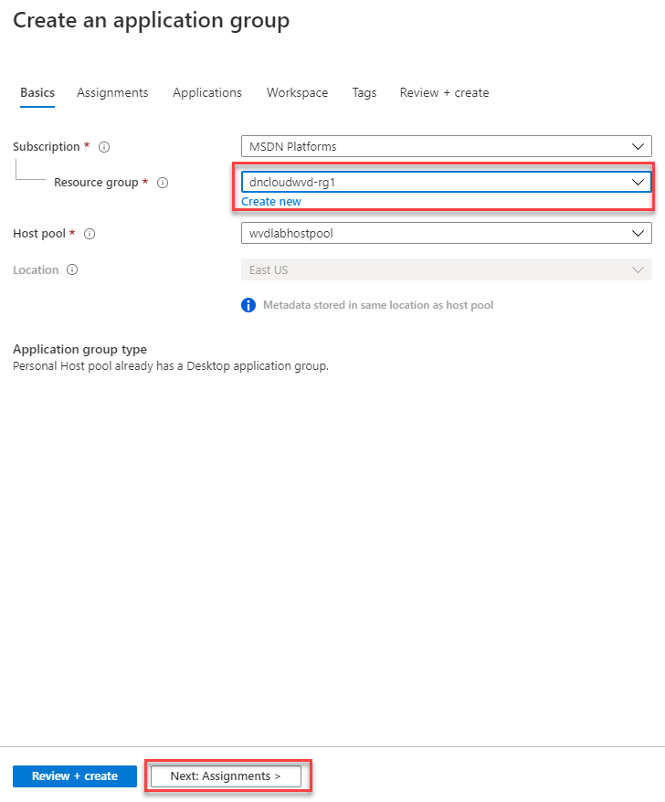

5.  On the Assignments page, Select **+ Add Azure AD users or user groups**.

6.  Search for the **RemoteApp Group** created earlier in this guide and choose **Select**.

7.  Select **Next: Applications**.

    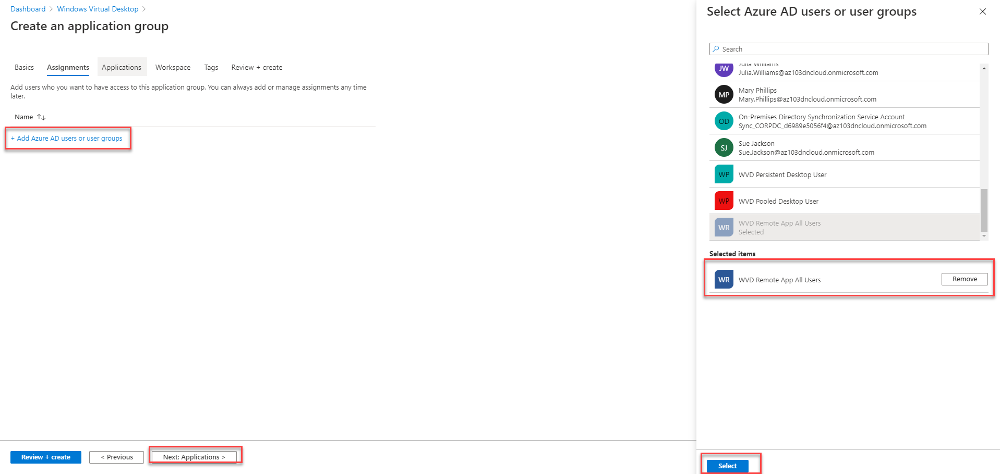

8.  On the Applications page, Select **+ Add Application**.

9.  On the Add Application fly out, next to Application source, select **Start Menu**. add the following applications, Selecting **Save** between selections.

    -    Outlook

    -    Word

    -    Microsoft Edge

    -    Microsoft Teams

    -    Excel

10. Select **Next: Workspace**.

11. On the Workspace page, select **Yes** to register the application group.

>**Note**: The **Register application group** field will automatically populate the application group we created earlier.

12. Select **Review + Create**.

13. Select **Create**.

You have successfully created a Remote App non-persistent Host Pool with published apps. You can validate this configuration when we connect to the environment in a later exercise.

## Exercise 7: Create a host pool for personal desktops

Duration:  20 minutes

In the new WVD ARM portal, Workspaces are the equivalent to Tenants in the Fall 2019 portal. This means we can create multiple Workspaces for different management purposes. This can be beneficial when working with multiple business groups within the same organization, providing logical segmentation of resources.

### Task 1: Create a new host pool and workspace

1.  Sign in to the [Azure Portal](https://portal.azure.com/).

2.  Search for **Windows Virtual Desktop** and select it from the list.

    

3.  Under Manage, select **Host pools** and Select **+ Add**.

    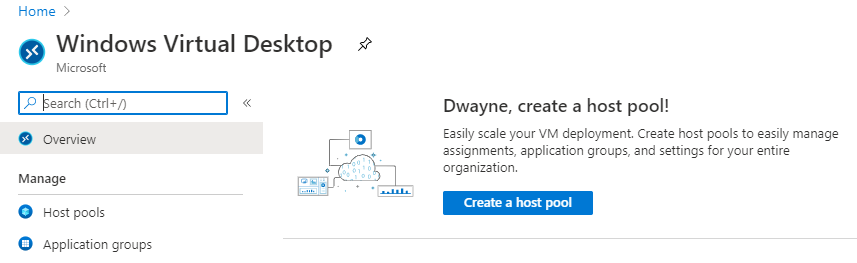

4.  On the Basics page, refer to the following screenshot to fill in the required fields. Once complete, Select **Next: Virtual Machine**.

       

5.  On the Virtual Machines page, refer to the following screenshot to fill in the required fields. Once complete, Select **Next: Workspace**.

    

6.  On the Workspace page, select **Yes** to register a new desktop app group. Select **Create new** and provide a **Workspace name**. Select **OK** and **Review + create**.

    

7.  On the Create a host pool page, Select **Create**.

### Task 2: Create a friendly name for the workspace

The name of the Workspace is displayed when the user signs in. Available resources are organized by Workspace. For a better user experience, we will provide a friendly name for our new Workspace.

1.  Sign in to the [Azure Portal](https://portal.azure.com/).

2.  Search for **Windows Virtual Desktop** and select it from the list.

3.  Under Manage, select **Workspaces**. Locate the Workspace you want to update and Select on the name.

4.  Under Settings, select **Properties**.

5.  Update the **Friendly name** field to your desired name.

6.  Select **Save**.

    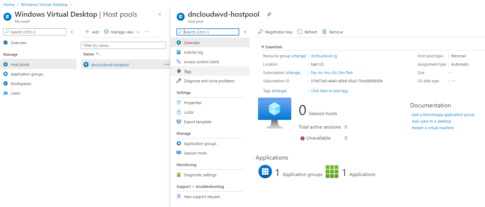

### Task 3: Assign Azure AD group to application group

In the new Windows Virtual Desktop ARM portal, we now have the ability to use Azure Active Directory groups to manage access to our host pools.

1.  Sign in to the [Azure Portal](https://portal.azure.com/).

2.  Search for **Windows Virtual Desktop** and select it from the list.

    

3.  Under Manage, select **Application groups**.

4.  Locate the Application group that was created as part of Task 1. In this exercise it is named "**WVD\_Pooled\_Desktop-DAG**". Select on the name.

5.  Under Manage, select **Assignments** and Select **+ Add**.

    

6.  In the fly out, enter the name of your Azure AD group. In this exercise we will select **WVD Persistent Desktop Users**.

7.  Select **Review + Create** to save your changes.

    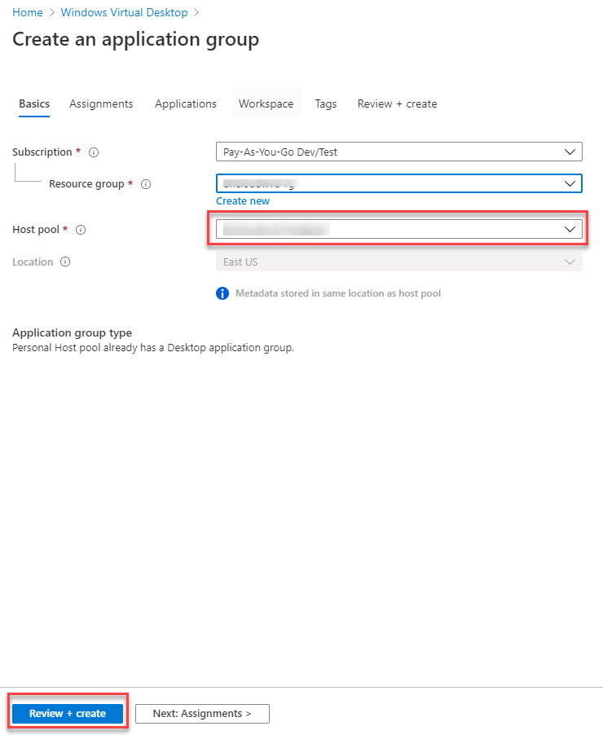

With the assignment added, you can move on to the next exercise. The users in the Azure AD group can be used to validate access to the new host pool in a later exercise.

## Exercise 8: Connect to WVD with the web client

Duration:  30 minutes

In this exercise we are going to walk through connecting to your WVD environment using the HTML5 web client and validating your deployment. The following operating systems and browsers are supported:

**Additional Resources**

There are multiple clients available for you to access WVD resources. Refer to the following Docs for more information about each client:
  |              |            |  
|----------|:-------------:|
| Description | Links |
|Connect with the Windows Desktop Client |  https://docs.microsoft.com/en-us/azure/virtual-desktop/connect-windows-7-and-10 |
| Connect with the HTML5 web client |  https://docs.microsoft.com/en-us/azure/virtual-desktop/connect-web |
| Connect with the Android client | https://docs.microsoft.com/en-us/azure/virtual-desktop/connect-android |
| Connect with the macOS client |  https://docs.microsoft.com/en-us/azure/virtual-desktop/connect-macos |
| Connect with the iOS client | https://docs.microsoft.com/en-us/azure/virtual-desktop/connect-ios |
  |              |            | 

### Task 1: Connecting with the HTML5 web client

1.  Open a supported web browser.

2.  Navigate to the https://rdweb.wvd.microsoft.com/arm/webclient.

    >**Note**: You will be asked to login when you access the above URL.  The credentials that you use are those from the lab.

3.  Sign in using a synchronized identity that has been assigned to an application group.

4.  Select an available resource from the web client. In this example we will connect to a host pool containing pooled desktop.

5.  On the **Access local resources** prompt, review the available options for and Select **Allow**.

6.  On the **Enter your credentials** prompt, sign in using the same account from Step 3 and Select **Submit**.

7.  Once connected, validate the components relative to your configuration:

    -    **FSLogix Profile Container**

         - Did the profile direct get created on the file share?
         - Is the profile appearing in Disk Management?
         - Do your profile settings persist when connecting to different hosts?

    -    **Business Applications**

         - Are the business applications in your image working as expected?

    -    **OneDrive**

         - Did OneDrive for Business automatically sign you in?
         - Is Folders on Demand and Known Folder Move enabled?

    -    **Teams**

         - Did Teams automatically sign you in?

    -    **Log Analytics Monitoring Agent**

         - Are there connection events logged for the session in your Logs Analytics workspace?

**Troubleshooting**

**Web client stops responding or disconnects**

Try connecting using another browser or client.

If issues continue even after you\'ve switched browsers, the problem may not be with your browser, but with your network. We recommend you contact network support.

**Web client keeps prompting for credentials**

If the Web client keeps prompting for credentials, follow these instructions:

1.  Confirm the web client URL is correct.

2.  Confirm that the credentials you\'re using are for the Windows Virtual Desktop environment tied to the URL.

3.  Clear browser cookies.

4.  Clear browser cache.

5.  Open your browser in Private mode.

## Exercise 9: Connect to WVD with the windows desktop client

Duration:  30 minutes

In this exercise we are going to walk through connecting to your WVD environment using the Windows desktop client and validating your deployment. Download and install the Windows desktop client using the following links:

-   [Windows 64-bit](https://go.microsoft.com/fwlink/?linkid=2068602) 

-   [Windows 32-bit](https://go.microsoft.com/fwlink/?linkid=2098960) 

-   [Windows ARM64](https://go.microsoft.com/fwlink/?linkid=2098961) 


**Additional Resources**

There are multiple clients available for you to access WVD resources. Refer to the following Docs for more information about each client:
  |              |            |  
|----------|:-------------:|
| Description | Links |
|Connect with the Windows Desktop Client |  https://docs.microsoft.com/en-us/azure/virtual-desktop/connect-windows-7-and-10 |
| Connect with the HTML5 web client |  https://docs.microsoft.com/en-us/azure/virtual-desktop/connect-web |
| Connect with the Android client | https://docs.microsoft.com/en-us/azure/virtual-desktop/connect-android |
| Connect with the macOS client |  https://docs.microsoft.com/en-us/azure/virtual-desktop/connect-macos |
| Connect with the iOS client | https://docs.microsoft.com/en-us/azure/virtual-desktop/connect-ios |
  |              |            | 

### Task 1: Connecting with the windows desktop client

1.  Open the Remote Desktop client.

    >**Note**: WVD does not support the RemoteApp and Desktop Connections (RDAC) client or the Remote Desktop Connection (MSTSC) client.

2.  From the Remote Desktop client, Select **Subscribe**.

3.  Sign in using a synchronized identity that has been assigned to an application group.

    >**Note**: The Windows client automatically defaults to Windows Virtual Desktop Fall 2019 release. However, if the client detects that the user also has Azure Resource Manager resources, it automatically adds the resources or notifies the user that they are available.

4.  Select an available resource from the Remote Desktop client. In this example we will connect to a host pool containing pooled desktop.

    >**Note**: You can right-click on desktop resources (non-app) and modify the default connection settings. For example, setting the default display configuration.

5.  On the **Enter your credentials** prompt, sign in using the same account from Step 3 and Select **OK**.

6.  Once connected, validate the components relative to your configuration:

    -    **FSLogix Profile Container**

         - Did the profile direct get created on the file share?
         - Is the profile appearing in Disk Management?
         - Do your profile settings persist when connecting to different hosts?

    -    **Business Applications**

         - Are the business applications in your image working as expected?

    -    **OneDrive**

         - Did OneDrive for Business automatically sign you in?
         - Is Folders on Demand and Known Folder Move enabled?

    -    **Teams**

         - Did Teams automatically sign you in?
  
    -    **Log Analytics Monitoring Agent**

         - Are there connection events logged for the session in your Logs Analytics workspace?

**Troubleshooting**

**Remote Desktop client stops responding or cannot be opened**

Starting with version 1.2.790, you can reset the user data from the **About** page or using a command.

**Resetting the app from the GUI**

1.  Open the Remote Desktop app.

2.  Select **More options** in the upper right corner and select **About**.

3.  Select **Reset** and **Continue**.

4.  Open the Remote Desktop client and re-subscribe by signing in.

**Resetting the app from the command line**

1.  Make sure the Remote Desktop client is not running.

2.  Open a command prompt and navigate to the installation folder.

    -   **User-based installation:** C:\\Users\<user\>\\AppData\\Local\\Apps\\Remote
        Desktop

    -   **Machine-based installation (64-bit):** C:\\Program Files\\Remote Desktop

3.  Run the following command:

    ```
    msrdcw.exe /reset
    ```

5.  On the warning dialog, Select **Yes**.

    >**Note**: You can use the /f switch to skip the confirmation dialog.

6.  Open the Remote Desktop client and re-subscribe by signing in.

## Exercise 10: Configure session hosts with Group Policy

Duration:  60 minutes

After working with the Windows 10 Marketplace builds, we found some areas that needed improvement. Our goal is to ensure that we are enabling the best experience for our customers and their users. This guide will cover the recommended configurations using Group Policy.

To perform the tasks of configuring group policy, we will require you to have access to your domain controller or to a Admin jump box where you can configure domain group policies. Perform the following steps on this system.

**Additional Resources**

  |              |            |  
|----------|:-------------:|
| Description | Links |
| Install Office on WVD master image | https://docs.microsoft.com/en-us/azure/virtual-desktop/install-office-on-wvd-master-image  |
| Outlook performance issues when there are too many items or folders | https://support.microsoft.com/en-us/help/2768656/outlook-performance-issues-when-there-are-too-many-items-or-folders-in |
| Microsoft Edge update policies | https://docs.microsoft.com/en-us/deployedge/microsoft-edge-update-policies |
| FSLogix group policy templates |  https://docs.microsoft.com/en-us/FSLogix/use-group-policy-templates-ht |
| FSLogix profile container configuration |  https://docs.microsoft.com/en-us/FSLogix/profile-container-configuration-reference |
| FSLogix Office container configuration |  https://docs.microsoft.com/en-us/FSLogix/office-container-configuration-reference) |
| OneDrive redirect known folders | https://docs.microsoft.com/en-us/onedrive/redirect-known-folders |
| OneDrive silent account configuration | https://docs.microsoft.com/en-us/onedrive/use-silent-account-configuration |
| Save disk space with OneDrive files on demand for Windows 10 |  https://support.office.com/en-us/article/Save-disk-space-with-OneDrive-Files-On-Demand-for-Windows-10-0e6860d3-d9f3-4971-b321-7092438fb38e |
| Set-up customized master image |  https://docs.microsoft.com/en-us/azure/virtual-desktop/set-up-customize-master-image |
 |              |            | 

### Task 1: Create a Group Policy backup

1.  **Download** the Group Policy Backup from this guide. [[WVD-GPO-Backups.zip]](https://raw.githubusercontent.com/shawntmeyer/WVD/master/GPOBackups/WVD-GPO-Backups.zip) 

2.  **Extract** the contents of Zip file.

These are Group Policy Backup files from which the customer can import the recommended configurations or set them on their own. There are HTML files to view what was configured as well as explanation of configuration later in this guide.

3.  Expand the extracted directories and open the **ADMX Templates** folder.

4.  Open a new file explorer session and navigate to:
   
 
    ``  \\\<domainname\>\\sysvol\<domainfqdn\>\\policies\\policydefinitions
    ``

5.  Copy the **admx** files from the ADMX Templates folder to the **policydefinitions** folder and copy the **adml** files to the **policydefinitions\\en-us** subfolder. If you are asked whether you want to replace existing files, make you decision based on the date of each file. Replace older files only.

6.  Open **Group Policy Management**, this is located under Windows Administrative tools in the Start Menu.

7.  Expand the directories until you find Group Policy Objects.

8.  Right-click Group Policy Objects and Select **New**, go ahead and create six new GPOs and name them after the six policies in the backup folder. After you are done, they should look like below.

    >**Note**: If you are helping a customer the name of the policy is not critical just what configured. So, customers should be encouraged to use
standard naming conventions.

9.  Right-click on each policy and select import Settings. Select next through backup GPO, on the backup locations screen select the folder where the backups are located.

10. Select next through backup GPO, on the backup locations screen select the folder where the backups are located.

11. Select the backup that corresponds to the policy selected.

12. Select next through all the prompts until you get a succeeded message.

13. Repeat this for the other five policies.

14. Review the GPO Settings of each policy in GPMC and the summary below. Change the settings to organizational preferences because they are set to Microsoft Recommendations as-is.

15. Now link these policies to the OU where your WVD resource are located.


### Task 2: Configure the Group Policy settings 

Provided below is a summary of the group policy settings that Microsoft recommends applying to Pooled desktops. Each policy is detailed with the policy setting and reasoning. For more information, open the HTML files in the extracted GPBackup folder you downloaded earlier.


**WVD Pooled - Microsoft 365 Apps - User Settings**
  
|              |            |               |
|----------|:-------------:|:-------------:|
 | **Policy**| **Value** |**Reason** |
 |  Show the option for Office Insider    |                       Disabled       |         Hides the option to join office insider |
  |Cached Exchange Mode Sync Settings          |                     One Month           |    Prevents bloating of outlook profiles on non-persistent machines.|
  |Use Cached Exchange Mode for new and existing outlook profiles   | Enabled                | Ensures all profiles are running cached. |
  | CalendarSyncWindowSetting       |                                 Primary Calendar Only  | Sync only the primary Calendar Folder, preventing bloat in the profile.|
 | CalendarSyncWindowSettingMonths                           |       1 Month                 | Setting to control the number of months in the Calendar Sync window |

**WVD Pooled - Microsoft 365 Apps - Computer Settings**


|              |            |               |
|----------|:-------------:|:-------------:|
 | **Policy**      |   **Value**    |    **Reason** |
 | Use Shared Computer Activation                    |     Enabled        |  Shared Computer Activation for shared desktops |
 | Enable Automatic Updates                          |     Disabled     |    Prevents office version drift between Hosts |
 | Hide option to enable or disable updates          |    Enabled      |    Prevents users for modifying settings |
 | Hide Update Notifications                         |     Enabled      |    Prevents notification to end user about available updates. |
 | Configure user Group Policy loopback processing mode  | Enabled: Merge |  Allows the Microsoft 365 User Policy to apply to users on these Session Hosts |


**WVD Pooled - Microsoft Edge Enterprise - Computer Settings**


|              |            |               |
|----------|:-------------:|:-------------:|
 | **Policy** |  **Value**   |  **Reason** |
|  Update policy override default  | Updates Disabled |  Disables automatic updates for Edge |

**WVD Pooled - Microsoft FSLogix - Computer Settings**


|              |            |               |
|----------|:-------------:|:-------------:|
|  **Policy** | **Value**  |  **Reason** |
 | Include Office Activation data in container  |Enabled |  Maintains user's office activation token in FSLogix profile |
 | Delete local profile when FSLogix Profile should apply | Enabled  |Prevents remnants of local profiles on session hosts |
  Enabled  |   Enabled  |   Enables the FSLogix Profile Container which is required for user state management on pooled desktops. |
  | Profile Type Normal direct-access profile This is the simplest configuration and allows only 1 connection to profile container VHD Location | Enabled \<servername>\<sharename> |  The location of the stored VHD Profile. Update for customer environment Swap Directory name components Enabled Sorts by User name rather than SID in profile folder |

**WVD Pooled - Microsoft OneDrive - Computer Settings**

|              |            |               |
|----------|:-------------:|:-------------:|
|  **Policy**   |  **Value**    |   **Reason** |
 | Silently move windows known folders to OneDrive   | Set Tenant ID  | This policy will silently move the users Documents, Desktop, and Photos to one drive, **requires the orgs AAD Tenant ID**.
 | Silently sign into OneDrive sync client with their windows credentials |  Enabled  |       Automatically configured one drive on sign in.
 | Use OneDrive Files On-Demand  | Enabled    |     Uses Files on Demand to prevent Profile bloat.

**WVD Pooled - Microsoft Windows - Computer Settings**

|              |            |               |
|----------|:-------------:|:-------------:|
 | **Policy**  |   **Value** |   **Reason** |
 | Allow Storage Sense | Disabled   |  Disables Storage Sense in Pooled VMs
 | Allow users to connect remotely by using remote desktop services |  Enabled   |   Enabled RDP in Host
|  Configure Keep-Alive connection intervals |  Enabled: 1 |  Time to keep session alive post disconnect to time out. This is to help make the session available to another host as soon as possible.
|  Configure Automatic Updates    | Disabled  |   Prevents hosts from updating on their own.

In addition to the Administrative templates settings specified in the table above, the WVD Pooled - Microsoft Windows - Computer Settings Group Policy Object (GPO) contains the following registry preference items:


  **Registry Path**  
  |              |            |               |
|----------|:-------------:|:-------------:|                                                          
|**Registry Key** | **Value** |  **Reason** |
 | HKLM\\Software\\Policies\\Microsoft\\Windows\\WorkplaceJoin                       BlockWorkplaceJoin  |           1  |         Block domain joined machines from inadvertently getting Azure AD registered by users |
 | HKLM\\SYSTEM\\CurrentControlSet\\Control\\Terminal Server\\WinStations\\RDP-Tcp   MaxMonitors  |  4   |        
|  HKLM\\SYSTEM\\CurrentControlSet\\Control\\Terminal Server\\WinStations\\RDP-Tcp   MaxXResolution   |              5120 |        
 | HKLM\\SYSTEM\\CurrentControlSet\\Control\\Terminal Server\\WinStations\\RDP-Tcp   MaxYResolution   |              2880  |      
 | HKLM\\SYSTEM\\CurrentControlSet\\Control\\Terminal Server\\WinStations\\RDP-Tcp   PortNumber    |                 3389   |     
 | HKLM\\SYSTEM\\CurrentControlSet\\Control\\Terminal Server\\WinStations\\RDP-Tcp   LanAdapter      |               0  |         
 | HKLM\\SYSTEM\\CurrentControlSet\\Control\\Terminal Server\\WinStations\\RDP-Tcp   UserAuthentication   |          1     |      
 | HKLM\\SYSTEM\\CurrentControlSet\\Control\\Terminal Server\\WinStations\\RDP-Tcp   SecurityLayer    |              1    |       
 | HKLM\\SYSTEM\\CurrentControlSet\\Control\\Terminal Server\\WinStations\\RDP-Tcp   fAllowSecProtocolNegotiation |  1     |      
|  HKLM\\SYSTEM\\CurrentControlSet\\Control\\Terminal Server\\WinStations\\RDP-Tcp   KeepAliveTimeout    |           1    |       
 | HKLM\\SYSTEM\\CurrentControlSet\\Control\\Terminal Server\\WinStations\\RDP-Tcp   fInheritReconnectSame    |      1     |     
 | HKLM\\SYSTEM\\CurrentControlSet\\Control\\Terminal Server\\WinStations\\RDP-Tcp   fReconnectSame     |            1   |        
 | HKLM\\SYSTEM\\CurrentControlSet\\Control\\Terminal Server\\WinStations\\RDP-sxs   MaxMonitors    |                4    |       
 | HKLM\\SYSTEM\\CurrentControlSet\\Control\\Terminal Server\\WinStations\\RDP-sxs   MaxXResolution   |              5120  |      
| HKLM\\SYSTEM\\CurrentControlSet\\Control\\Terminal Server\\WinStations\\RDP-sxs   MaxYResolution   |              2880   |     
 | HKLM\\ SYSTEM\\CurrentControlSet\\Control\\TimeZoneInformation                    RealTimeIsUniversal   |         1      |     
 |              |            |  


## Exercise 11: Setup monitoring for WVD

Duration:  45 minutes

In this exercise we will setup monitoring for our WVD host pools. There are multiple reasons why monitoring serves a critical role; troubleshooting, performance, security, etc. There are also multiple components that make up the WVD service, which can add some variation on how customers implement monitoring (e.g. adding additional third-party solutions). By the end of this exercise you will have the following monitoring capabilities enabled:

-   Diagnostic logging for the WVD service

-   Azure Monitor for the session host VMs

-   Log Analytics Monitoring Agent for the session host VMs


**Additional Resources**

  |              |            |  
|----------|:-------------:|
| Description | Links |
| Use Log Analytics for diagnostic features | https://docs.microsoft.com/en-us/azure/virtual-desktop/diagnostics-log-analytics |
| Create diagnostic settings to collect resource logs and metrics in Azure |  https://docs.microsoft.com/en-us/azure/azure-monitor/platform/diagnostic-settings |
| PG Blog for Log Analytics Dashboard and Azure Monitor | https://techcommunity.microsoft.com/t5/windows-it-pro-blog/proactively-monitor-arm-based-windows-virtual-desktop-with-azure/ba-p/1508735 |
|Enable monitoring for a single Azure VM |  https://docs.microsoft.com/en-us/azure/azure-monitor/insights/vminsights-enable-single-vm#enable-monitoring-for-a-single-azure-vm |
|Enable Azure Monitor for VMs by using Azure Policy |   https://docs.microsoft.com/en-us/azure/azure-monitor/insights/vminsights-enable-at-scale-policy |
|Enable Azure Monitor for VMs using Azure templates |  https://docs.microsoft.com/en-us/azure/azure-monitor/insights/vminsights-enable-at-scale-powershell |
  |              |            |

### Task 1: Create a Log Analytics workspace

A Log Analytics workspace is required for each of the monitoring capabilities covered in this exercise. You have the option to stream log data into different workspaces if desired. There are several factors to consider around a single workspace versus multiple. For example, RBAC controls, query performance, report development, etc. For WVD
environments, it is common to have all monitor data pointing to a single dedicated workspace.

In this exercise we will create a dedicated workspace for our environment. If you already have a workspace created, move on to Task 2.

1.  Sign in to the [Azure Portal](https://portal.azure.com/).

2.  At the top of the page, in the **Search resources** field, type \"**log analytics**\". Select **Log Analytics workspaces** from the list.

    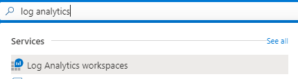

3.  On the Log Analytics workspaces blade, Select **+Add**.

    

4.  On the Create Log Analytics workspace blade, fill in the following information and Select **Review + Create**.

    -    **Subscription:** Select the desired subscription for the Log Analytics workspace.

    -    **Resource Group:** Create a new resource group or select one from the list.

    -    **Name:** Enter a unique name for the workspace.

    -    **Region:** Select a region for the workspace.

5.  Select **Create**.

    

Monitor the notification bell in the upper-right corner and wait for the deployment to complete. Once complete, move on to task 2.

### Task 2: Enabling diagnostic logging for WVD

Like many other Azure services, WVD uses Azure Monitor for monitoring and alerts. In order to enable diagnostic data collection, you need to enable it for each ARM object that you want to monitor (e.g. Host pools, Application groups, and Workspaces). Once enabled, it can take a few hours for the data to appear in your workspace.

Each WVD ARM object has different diagnostic data categories available. For example, host pool objects will have a different set of options then Workspaces. Refer to the following table for a summary of each data category and their associated objects.

  |              |            |     |
|----------|:-------------:|:-------------:|
| **Category**  |**Description**  |                                                                 **ARM Object(s)** |
  Checkpoint   |       Specific steps in the lifetime of an activity that were reached. For example, during a session, a user was load balanced to a particular host, then the user was signed on during a connection, and so on. |  Host pools, Application groups, Workspaces
  Connection    |      When users initiate and complete connections to the service.    |                                                                                                                                             Host pools
  Error       |        Are users encountering any issues with specific activities? This feature can generate a table that tracks activity data for you as long as the information is joined with the activities.     |               Host pools, Application groups, Workspaces |
  Feed   |             Can users successfully subscribe to workspaces? Do users see all resources published in the Remote Desktop client?      |                                                                                     Workspaces |
  Host Registration  | Was the session host successfully registered with the service upon connecting?       |                                                                                 Host pools| 
  Management     |     Track whether attempts to change Windows Virtual Desktop objects using APIs or PowerShell are successful. For example, can someone successfully create a host pool using PowerShell?       |                  Host pools, Application groups, Workspaces

### Task 3: Enable logging for host pools

1.  Sign in to the [Azure Portal](https://portal.azure.com/).

2.  At the top of the page, in the **Search resources** field, type \"**windows virtual desktop**\". Select **Windows Virtual Desktop** from the list.

    

3.  On the Windows Virtual Desktop blade, under **Manage**, select **Host pools**.

4.  On the Windows Virtual Desktop \| Host pools blade, locate a host pool and Select on the name.

5.  On the blade for your host pool, under **Monitoring**, select **Diagnostic settings**.

6.  On the Diagnostics settings blade, Select **+Add diagnostic setting**.

    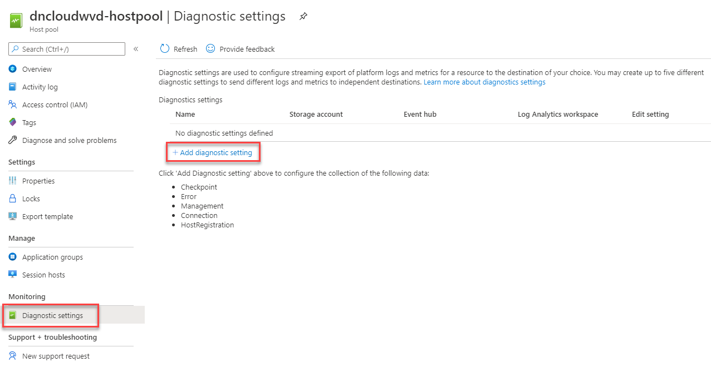

7.  On the Diagnostic settings page, fill in the following information and Select **Save**.

    -    **Diagnostic settings name:** Enter a name for these settings. ARM objects can have multiple diagnostic settings applied.

    -    **Category details \| log:** Check the box for the logs that you want to collect.

    -    **Destination details \| Send to Log Analytics:** Check this box.

         - **Subscription:** Select the desired subscription.

         - **Log Analytics workspace:** Select the desired workspace.


    

### Task 4: Enable logging for application groups

1.  Sign in to the [Azure Portal](https://portal.azure.com/).

2.  At the top of the page, in the **Search resources** field, type \"**windows virtual desktop**\". Select **Windows Virtual Desktop** from the list.

    

3.  On the Windows Virtual Desktop blade, under **Manage**, select **Application groups**.

4.  On the Windows Virtual Desktop \| Application groups blade, locate an application group and Select on the name.

5.  On the blade for your application group, under **Monitoring**, select **Diagnostic settings**.

6.  On the Diagnostics settings blade, Select **+Add diagnostic setting**.

    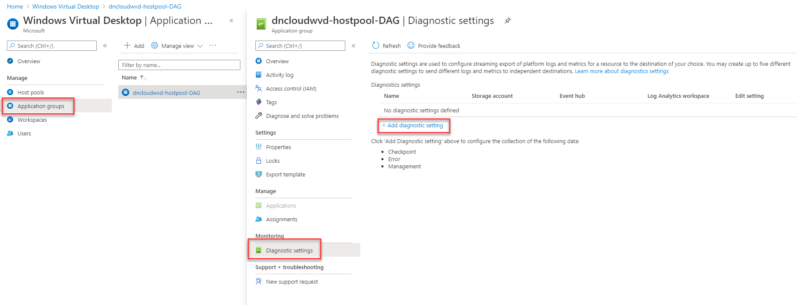

7.  On the Diagnostic settings page, fill in the following information and Select **Save**.

    -    **Diagnostic settings name:** Enter a name for these settings. ARM objects can have multiple diagnostic settings applied.

    -    **Category details \| log:** Check the box for the logs that you want to collect.

    -    **Destination details \| Send to Log Analytics:** Check this box.

            - **Subscription:** Select the desired subscription.

            - **Log Analytics workspace:** Select the desired workspace.

    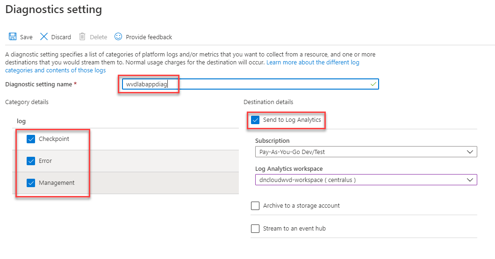

### Task 5: Enable logging for workspaces

1.  Sign in to the [Azure Portal](https://portal.azure.com/).

2.  At the top of the page, in the **Search resources** field, type \"**windows virtual desktop**\". Select **Windows Virtual Desktop** from the list.

    

3.  On the Windows Virtual Desktop blade, under **Manage**, select **Workspaces**.

4.  On the Windows Virtual Desktop \| Workspaces blade, locate a workspace and Select on the name.

5.  On the blade for your workspace, under **Monitoring**, select **Diagnostic settings**.

6.  On the Diagnostics settings blade, Select **+Add diagnostic setting**.

    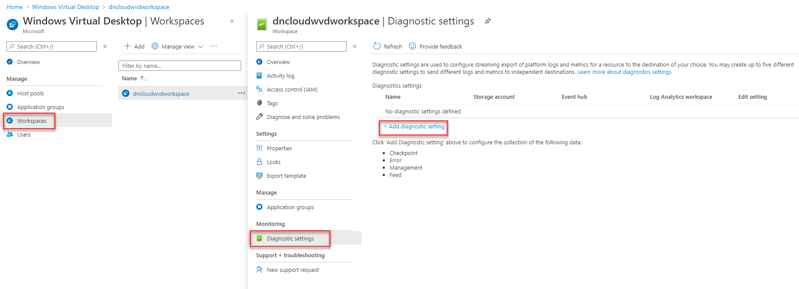

7.  On the Diagnostic settings page, fill in the following information and Select **Save**.

    -    **Diagnostic settings name:** Enter a name for these settings. ARM objects can have multiple diagnostic settings applied.

    -    **Category details \| log:** Check the box for the logs that you want to collect.

    -    **Destination details \| Send to Log Analytics:** Check this box.

            -    **Subscription:** Select the desired subscription.

            -    **Log Analytics workspace:** Select the desired workspace.

    

At this point you should have diagnostic data enabled on at least 1 WVD ARM object of each type. To enable monitoring for additional objects, rinse and repeat the above steps.

### Task 6: Enabling Azure Monitor for the session hosts

Azure Monitor is leveraged with WVD to monitor the performance and health of your session host VMs. This feature can be enabled for Azure VMs in a number of ways. In this exercise we will walk through enabling Azure Monitor on VMs using the Azure portal. Refer to the following links for guidance on automation.


1.  Sign in to the [Azure Portal](https://portal.azure.com/).

2.  At the top of the page, in the **Search resources** field, type \"**virtual machines**\". Select **Virtual Machines** from the list.

    

3.  On the Virtual Machines blade, locate a session host VM and Select on the name.

4.  On the blade for the virtual machine, under **Monitoring**, select **Insights**.

    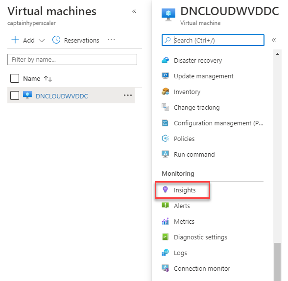

5.  On the Insights blade, Select **Enable**. This will initiate a validation check.

    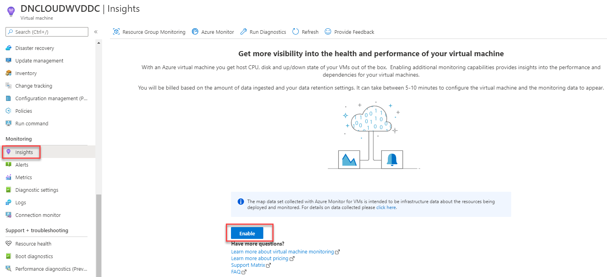

    >**Note**: The virtual machine must be running to enable Azure Monitor.

6.  On the Insights setup page, fill in the following information and Select **Enable**.

    -    **Workspace Subscription:** Select the desired subscription.

    -    **Choose a Log Analytics Workspace:** Select the workspace used in the previous task.

    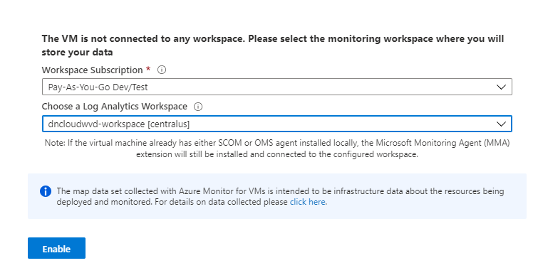

Monitor the notification bell in the upper-right corner and wait for the deployment to complete. This can take 5-10 minutes. Once complete, you will see the following items configured on the VM:

**New VM Extensions Added**. Two new extensions are added to the VM Extensions blade in Azure.

**New Monitoring Agents Installed**. Two new agents are installed on the VM.

**Monitoring Agent Configured for Log Analytics** The Microsoft Monitoring Agent is configured for your log analytics workspace.

At this point you should have Azure Monitor enabled on at least one session host VM. To enable Azure Monitor for additional session hosts, repeat the above steps. For automation, leverage Azure Policy or PowerShell to enable monitoring on multiple VMs.

**Example Kusto Queries**

For a list of example queries, refer to the following Docs article:

[**Use Log Analytics for the diagnostics feature \| Example queries**](https://docs.microsoft.com/en-us/azure/virtual-desktop/diagnostics-log-analytics#example-queries) 

**Troubleshooting**

- Go to your Log Analytics workspace, and then select **Logs**. The example query UI is shown automatically.
- Change the filter to **Category**.
- Select **Windows Virtual Desktop** to review available queries.
- Select **Run** to run the selected query.

Often during the deployment of WVD there may be challenges with either having machines join the domain or installing the agent via automation.


## After the hands-on lab

Duration:  15 minutes

| WARNING: Prior to continuing you should remove all resources used for this lab.  To do this in the **Azure Portal** click **Resource groups**.  Select any resources groups you have created.  On the resource group blade click **Delete Resource group**, enter the Resource Group Name and click **Delete**.  Repeat the process for any additional Resource Groups you may have created. **Failure to do this may cause issues with other labs.** |
   
### Task 1: Delete Resource groups to remove lab environment

1. Go to the **Azure portal**

2. Go to your **Resource groups**

    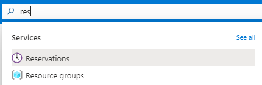

3. Select the **Resource group** that you created your resources

4. Select **Delete Resource group**

    

   
5. Enter the name of the **Resource group** and select **Delete**

    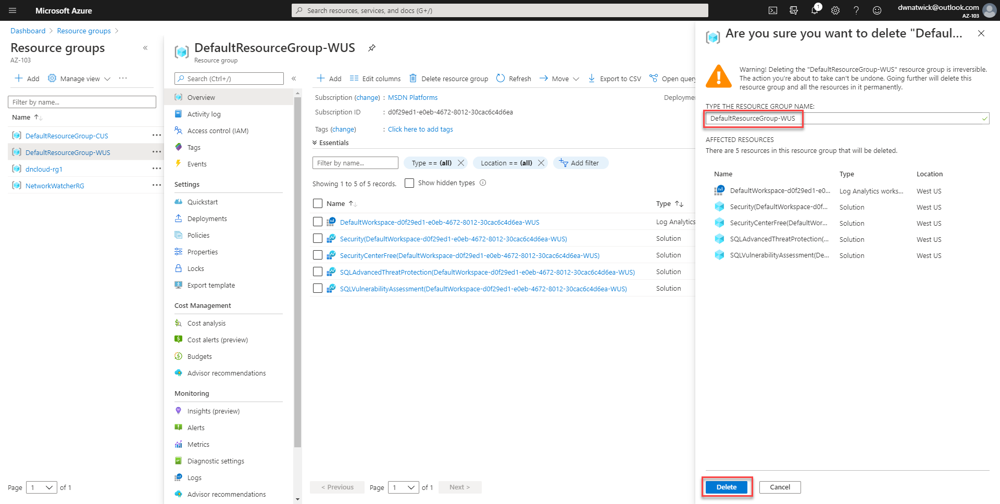

   
6. Repeat these steps for all **Resource groups** created for this lab, including those for **Azure Monitor** and **Log Analytics**
   
You should follow all steps provided *after* attending the Hands-on lab.

